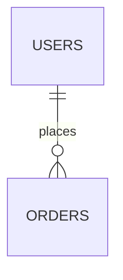

# Full Stack Web Development Curriculum

An interactive, modern curriculum platform for teaching Full Stack Web Development. Built with **Next.js (App Router)** and **MDX** to deliver high-quality, localized course content — primarily in Khmer with technical terms kept in English.

## 🚀 Tech Stack

| Category | Library / Tool |
|---|---|
| Framework | Next.js 16 (App Router) |
| Language | TypeScript 5 |
| UI | React 19 |
| Styling | Tailwind CSS 4 + `@tailwindcss/typography` |
| Content | `react-markdown`, `remark-gfm`, `gray-matter` |
| Syntax Highlighting | `prism-react-renderer` |
| Diagrams | Mermaid.js 11 (client-side) |
| Icons | `lucide-react` |

## 📁 Project Structure

```
src/
├── app/                   # Next.js App Router pages
│   ├── courses/[courseSlug]/
│   │   └── lessons/[lessonSlug]/
│   ├── layout.tsx
│   └── page.tsx
├── components/            # Reusable UI components
│   ├── css-diagrams/
│   ├── html-diagrams/
│   ├── js-diagrams/
│   ├── CodeBlock.tsx
│   ├── TabbedCodeBlock.tsx
│   ├── LessonContent.tsx
│   ├── LessonSidebar.tsx
│   ├── MobileLessonSidebar.tsx
│   ├── ModuleAccordion.tsx
│   ├── Mermaid.tsx
│   ├── CourseCard.tsx
│   └── ThemeToggle.tsx
├── courses/               # MDX lesson content
│   ├── course-overview/
│   ├── html/
│   ├── css/
│   ├── bootstrap/
│   ├── javascript/
│   ├── git/
│   ├── typescript/
│   ├── rdbms/
│   ├── react/
│   ├── nextjs/
│   ├── backend/
│   └── deployment/
├── lib/
│   └── courses.ts         # Content loading utilities
└── types/
    └── index.ts           # Shared TypeScript types
```

## 📚 Curriculum

| Module | Topics |
|---|---|
| Course Overview | Client-server model, HTTP/HTTPS, REST APIs, dev environment setup |
| HTML | Semantic structure, attributes, forms, tables |
| CSS | Selectors, specificity, box model, Flexbox/Grid, positioning, modern units, animations |
| Bootstrap | 12-column grid, Cards, Navbar, Modals, utility classes |
| JavaScript | Variables & scope, DOM, array methods, ES6+, fetch API |
| Git & GitHub | Version control, branching, merging, stashing, conflict resolution |
| TypeScript | Types, generics, utility types, strict mode |
| RDBMS (PostgreSQL) | Database design, ERD, normalization, SQL, joins, JSONB |
| React | Hooks, state management (Redux Toolkit), routing, forms (Zod + RHF), Axios |
| Next.js | App Router, server vs client components, data fetching, Vercel deployment |
| Backend Architecture | Server-side concepts and API design |
| Deployment | Hosting, CI/CD, and production workflows |

## 🛠️ Getting Started

```bash
npm install
npm run dev
```

Open [http://localhost:3000](http://localhost:3000) to explore the platform.

Other scripts:

```bash
npm run build   # Production build (static export)
npm run lint    # ESLint
```

## 📝 Writing Lessons

Lessons are `.mdx` files inside `src/courses/<course-slug>/`. Each file requires YAML frontmatter:

```yaml
---
title: "Lesson Title"
description: "A brief description in Khmer."
objectives:
  - "Objective 1"
  - "Objective 2"
module: module-1-name
order: 1
quiz:
  - question: "Question text?"
    options:
      - "Option 1"
      - "Option 2"
    correctAnswer: 1
    explanation: "Explanation text."
---
```

Required fields: `title`, `description`, `objectives`, `module`, `order`.  
The `quiz` block is optional.

## 🗺️ Mermaid Diagrams

Use a standard fenced code block with the `mermaid` language tag:

````markdown

````

## 🚀 Deployment

The site is configured for **static export** (`output: "export"`) and deploys automatically to **GitHub Pages** via GitHub Actions on every push to `main`.
