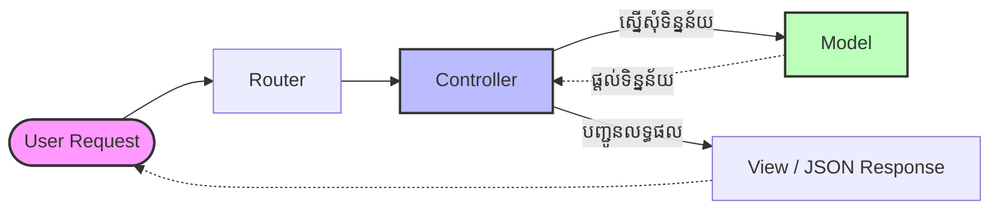

## 🚀 អ្វីទៅជា Node.js?


ជាទូទៅ **JavaScript** គឺជាភាសាដែលដំណើរការតែនៅលើកម្មវិធីរុករក (Browser) ដូចជា Chrome ឬ Firefox ប៉ុណ្ណោះ។ ប៉ុន្តែជាមួយនឹងការបង្កើតឡើងនូវ **Node.js** វាបានអនុញ្ញាតឱ្យយើងយកកូដ JavaScript មកដំណើរការនៅលើ **Server** វិញម្តង។ 

អត្ថន័យសាមញ្ញ៖ **Node.js** គឺជាបរិស្ថាន (Runtime Environment) ដែលអនុញ្ញាតឱ្យអ្នកសរសេរកូដ JavaScript ដើម្បីបង្កើត Backend Server, ភ្ជាប់ Database, និងបង្កើត APIs។

### 💡 ហេតុអ្វីបានជា Node.js លឿន?
Node.js ត្រូវបានបង្កើតឡើងនៅលើ **V8 Engine** របស់ Google Chrome ដែលវាបម្លែងកូដ JavaScript ទៅជាកូដម៉ាស៊ីន (Machine Code) ផ្ទាល់តែម្តង ដែលធ្វើអោយមានល្បឿនលឿនខ្លាំង។

---

## 🔄 របៀបដំណើរការរបស់ Node.js (Event Loop & Non-blocking I/O)

ចំណុចពិសេសបំផុតរបស់ Node.js គឺវាដំណើរការជាលក្ខណៈ **Single-Threaded** និង **Non-blocking I/O**។

- **Blocking (សរសេរកូដធម្មតា):** នៅពេល Server ទទួលការបញ្ជាឱ្យទៅយកទិន្នន័យពី Database វាត្រូវឈប់រង់ចាំទិន្នន័យនោះមកដល់សិន ទើបវាអាចបន្តទៅធ្វើការងារផ្សេងទៀតបាន។ បើមានអ្នកប្រើប្រាស់ច្រើន វានឹងគាំង (Blocked)។
- **Non-blocking (របៀប Node.js):** ពេលមានការស្នើសុំទៅ Database វាគ្រាន់តែបញ្ជូនការងារនោះទៅឱ្យប្រព័ន្ធផ្សេងធ្វើ ហើយវាដើរទៅទទួលការងារថ្មីពីអ្នកប្រើប្រាស់ផ្សេងទៀតភ្លាមៗ។ ពេល Database រកទិន្នន័យឃើញ វានឹងប្រាប់ Node.js វិញតាមរយៈយន្តការមួយហៅថា **Event Loop**។

```javascript
// ឧទាហរណ៍នៃការអាន File បែប Non-blocking (Asynchronous)
const fs = require('fs');

console.log("ចាប់ផ្តើមការងារទី ១");

// ការអាន File នេះមិនធ្វើអោយកូដនៅខាងក្រោមគាំងរង់ចាំទេ
fs.readFile('data.txt', 'utf8', (err, data) => {
    console.log("ការអាន File បានបញ្ចប់");
});

console.log("ចាប់ផ្តើមការងារទី ២");

/* 
លទ្ធផលនឹងចេញមក:
១. ចាប់ផ្តើមការងារទី ១
២. ចាប់ផ្តើមការងារទី ២
៣. ការអាន File បានបញ្ចប់ (ចេញក្រោយគេ ទោះបីសរសេរមុនក៏ដោយ)
*/
```

---

## 🏗️ ស្ថាបត្យកម្ម MVC (Model-View-Controller)

នៅពេលដែលកម្មវិធីកាន់តែធំ កូដរបស់អ្នកនឹងចាប់ផ្តើមរញ៉េរញ៉ៃ។ ដូច្នេះហើយ ទើបអ្នកអភិវឌ្ឍន៍ប្រើប្រាស់ **ស្ថាបត្យកម្ម MVC** ដើម្បីរៀបចំរចនាសម្ព័ន្ធកូដអោយមានរបៀបរៀបរយ។

1. **M - Model (តំណាងអោយទិន្នន័យ):**
   - ទទួលខុសត្រូវក្នុងការសន្ទនាជាមួយ Database។
   - វាកំណត់ទម្រង់ទិន្នន័យ និងដោះស្រាយការទាញយក/កែប្រែទិន្នន័យ។

2. **V - View (តំណាងអោយការបង្ហាញ):**
   - ជាអ្វីដែលអ្នកប្រើប្រាស់មើលឃើញ (UI) ដូចជា HTML, CSS ឬ React Components។
   - ក្នុងនាមជា Backend Developer យើងច្រើនតែមិនសូវផ្តោតលើ View ទេ ព្រោះយើងបង្កើតជា API ដើម្បីបញ្ជូនទិន្នន័យ (JSON) អោយខាង Frontend អ្នករៀបចំ View វិញ។

3. **C - Controller (អ្នកគ្រប់គ្រងបញ្ជា):**
   - ជាខួរក្បាលកណ្តាលដែលឈរនៅចន្លោះ Route, Model និង View។
   - វាទទួល Request ពីអ្នកប្រើប្រាស់ ហៅ Model អោយទាញទិន្នន័យ បន្ទាប់មកបញ្ជូនលទ្ធផលទៅកាន់ View ឬបញ្ជូនជា JSON វិញ។



នៅក្នុងមេរៀនបន្ទាប់ យើងនឹងចាប់ផ្តើមប្រើប្រាស់ **Express.js** ដែលជា Framework ដ៏ល្បីល្បាញរបស់ Node.js ដើម្បីបង្កើត Server និងរៀបចំ MVC នេះដោយផ្ទាល់។
