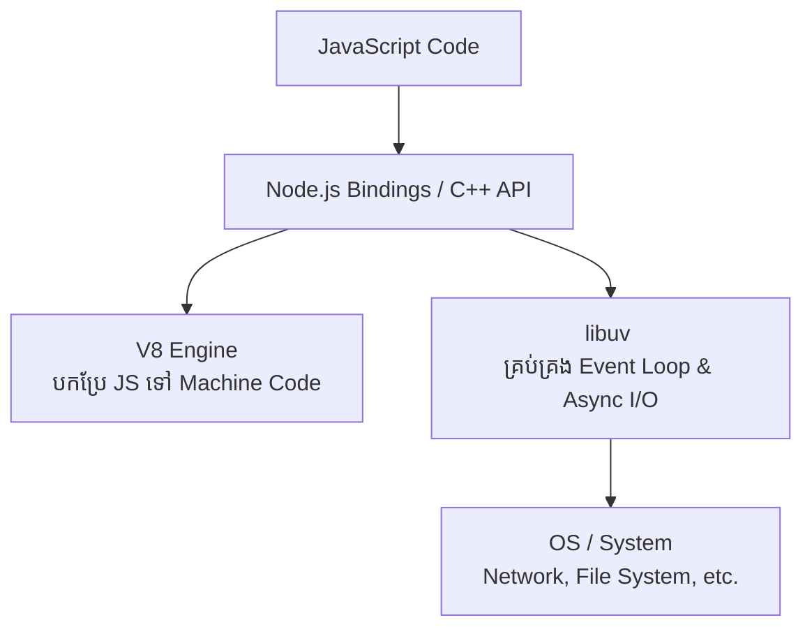

## 🚀 អ្វីទៅជា Node.js?

**Node.js** មិនមែនជាភាសា Programming ទេ ហើយក៏មិនមែនជា Framework ដែរ។ វាគឺជា **JavaScript Runtime Environment** ដែលអនុញ្ញាតឱ្យអ្នកដំណើរការកូដ JavaScript នៅក្រៅ Browser (ពោលគឺនៅលើ Server)។

មុនពេលមាន Node.js, JavaScript អាចរត់បានតែនៅលើ Browser ប៉ុណ្ណោះ (ដូចជា Chrome, Firefox) ដើម្បីធ្វើការងារជាមួយ UI។ Node.js បាននាំយក JavaScript មកកាន់ពិភព Backend។

### រចនាសម្ព័ន្ធរបស់ Node.js (Node.js Architecture)

Node.js ត្រូវបានបង្កើតឡើងដោយប្រើប្រាស់បច្ចេកវិទ្យាសំខាន់ៗពីរ៖

1. **V8 Engine (ពី Google Chrome):** ជាអ្នកបំប្លែងកូដ JavaScript ទៅជា Machine Code (ភាសាកុំព្យូទ័រ) ដើម្បីឱ្យ CPU អាចយល់បាន។
2. **libuv:** ជាបណ្ណាល័យ (Library) សរសេរដោយភាសា C ដែលផ្តល់នូវមុខងារ Event Loop និង Asynchronous I/O ធ្វើឱ្យ Node.js អាចធ្វើការងារបានច្រើនក្នុងពេលតែមួយដោយមិនចាំបាច់រង់ចាំ (Non-blocking I/O)។



> [!TIP]
> **Pro Insight:** Node.js ប្រើប្រាស់ **Single-Threaded Architecture** តែវាអាចទប់ទល់នឹង Request រាប់ម៉ឺនក្នុងពេលតែមួយបានយ៉ាងល្អប្រសើរ ដោយសារតែសមត្ថភាព Non-blocking I/O របស់វា។

### ហេតុអ្វីបានជាគេពេញនិយមប្រើ Node.js?
- ប្រើភាសា **JavaScript តែមួយ** ទាំង Frontend ទាំង Backend (Full-Stack)។
- ល្បឿនលឿន និងស៊ីធនធានតិច (Lightweight)។
- មានប្រព័ន្ធ Ecosystem ធំបំផុត (NPM)។

### ការអនុវត្តជាក់ស្តែង (Lab Exercise)

តោះសាកល្បងសរសេរកូដ Node.js ដំបូងរបស់អ្នក៖

1. បង្កើតឯកសារឈ្មោះ `app.js`
2. សរសេរកូដ៖
```javascript
console.log("Hello Backend Engineering!");
console.log("OS Platform:", process.platform);
```
3. ដំណើរការវានៅក្នុង Terminal តាមរយៈពាក្យបញ្ជា `node app.js`
