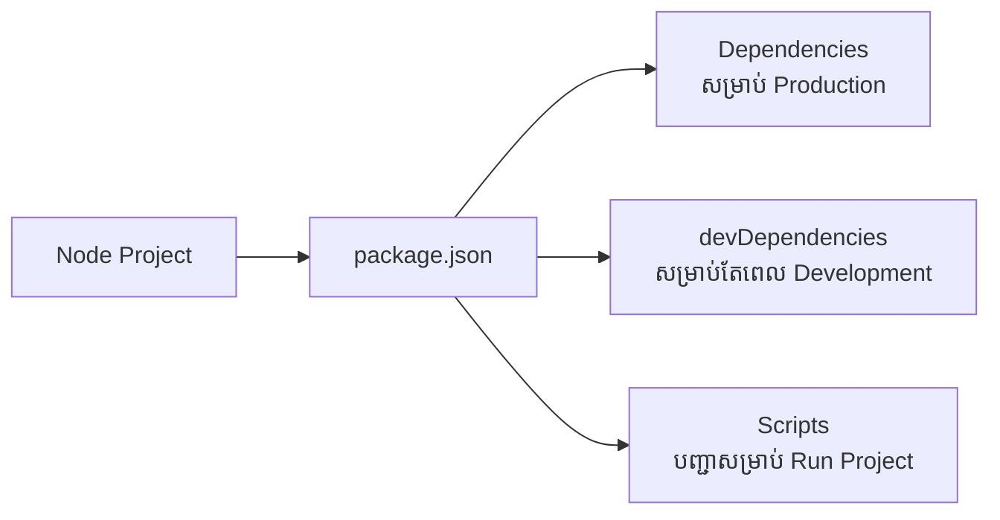

## 📦 អ្វីទៅជា NPM?

**NPM (Node Package Manager)** គឺជាកន្លែងផ្ទុកកញ្ចប់កូដ (Packages/Libraries) របស់ JavaScript ដ៏ធំបំផុតនៅលើពិភពលោក។ នៅពេលអ្នកដំឡើង Node.js វានឹងដំឡើង `npm` មកជាមួយដោយស្វ័យប្រវត្តិ។

អ្នកអាចប្រើ NPM ដើម្បី៖
1. ទាញយក Library ដែលអ្នកដទៃសរសេររួចមកប្រើ (ឧទាហរណ៍៖ `express`, `mongoose`)។
2. ចែករំលែកកូដរបស់អ្នកទៅកាន់អ្នកដទៃ។
3. គ្រប់គ្រង Version របស់ Library ក្នុង Project អ្នកកុំអោយមានបញ្ហា។

### ឯកសារ `package.json`

រាល់គម្រោង Node.js ទាំងអស់តែងតែចាប់ផ្តើមជាមួយឯកសារ `package.json`។ វាប្រៀបដូចជា **អត្តសញ្ញាណប័ណ្ណ** របស់គម្រោងអ្នកអញ្ចឹង។ វាផ្ទុកព័ត៌មានអំពីឈ្មោះគម្រោង, Version, និងបញ្ជីឈ្មោះ Library ដែលគម្រោងរបស់អ្នកត្រូវការ។



### ភាពខុសគ្នារវាង Dependencies ទាំងពីរ

1. **dependencies**: (ឧទាហរណ៍: `express`, `bcrypt`) 
   - ជា Library ដែលចាំបាច់ត្រូវមានទើបកម្មវិធីយើងដើរ។
   - ដំឡើងដោយ៖ `npm install express`
   
2. **devDependencies**: (ឧទាហរណ៍: `nodemon`, `jest`)
   - ជា Library ដែលប្រើសម្រាប់តែពេលយើងកំពុងសរសេរកូដប៉ុណ្ណោះ។ ពេលដាក់អោយគេប្រើពិតប្រាកដ (Production) មិនត្រូវការវាទេ។
   - ដំឡើងដោយ៖ `npm install --save-dev nodemon`

> [!WARNING]
> កុំ Push ថត `node_modules` ទៅកាន់ GitHub អោយសោះ! យើងគ្រាន់តែ Push ឯកសារ `package.json` ទៅបានហើយ ព្រោះអ្នកផ្សេងអាចទាញយក Library មកវិញបានដោយគ្រាន់តែវាយ Command `npm install`។

### ការអនុវត្តជាក់ស្តែង (Lab Exercise)

1. បង្កើតថតថ្មីមួយ ហើយចូលទៅកាន់ថតនោះ៖
   ```bash
   mkdir my-first-app && cd my-first-app
   ```
2. បង្កើត `package.json` ដោយស្វ័យប្រវត្តិ៖
   ```bash
   npm init -y
   ```
3. ដំឡើង Library ឈ្មោះ `colors`៖
   ```bash
   npm install colors
   ```
