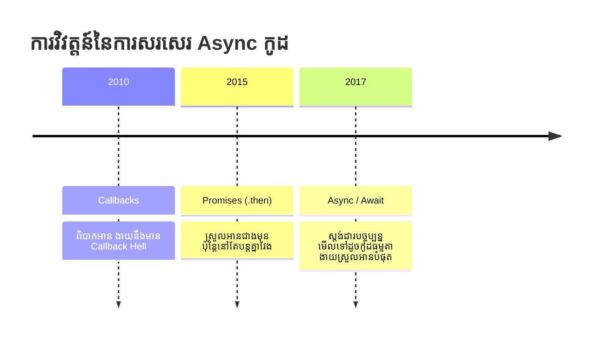

## ⏳ Asynchronous Programming

នៅក្នុង Node.js យើងតែងតែធ្វើការជាមួយអ្វីដែលតម្រូវឱ្យ "រង់ចាំ" (ឧទាហរណ៍៖ ទាញទិន្នន័យពី Database, អាន File, Call ទៅ API ផ្សេង)។ 
ដោយសារ Node.js គឺជា Single-Thread (មានអ្នកធ្វើការតែម្នាក់) បើយើងអោយវាឈប់ចាំទាល់តែទាញទិន្នន័យពី Database ហើយទើបធ្វើការផ្សេងទៀត នោះកម្មវិធីទាំងមូលនឹងគាំង។

ដំណោះស្រាយគឺ **Asynchronous** (ធ្វើការដោយមិនរង់ចាំគ្នា)។

### ការវិវត្តន៍នៃការសរសេរកូដ Async



### 1. បញ្ហារបស់ Callbacks (Callback Hell)

```javascript
// ❌ មិនណែនាំ (ពិបាកអាន និងពិបាកចាប់ Error)
getUser(1, (user) => {
    getPosts(user.id, (posts) => {
        getComments(posts[0].id, (comments) => {
            console.log(comments);
        });
    });
});
```

### 2. ការដោះស្រាយដោយប្រើ Promises

Promise គឺជាការសន្យាថានឹងផ្តល់លទ្ធផលមកវិញនៅពេលអនាគត (អាចជាជោគជ័យ `resolve` ឫបរាជ័យ `reject`)។

```javascript
// ⚠️ អាចទទួលយកបាន
getUser(1)
    .then(user => getPosts(user.id))
    .then(posts => getComments(posts[0].id))
    .then(comments => console.log(comments))
    .catch(error => console.error(error));
```

### 3. ស្តង់ដារបច្ចុប្បន្ន: Async / Await

```javascript
// ✅ ណែនាំអោយប្រើរាល់ថ្ងៃ
const fetchUserData = async () => {
    try {
        const user = await getUser(1);           // រង់ចាំរហូតដល់បាន User
        const posts = await getPosts(user.id);   // រង់ចាំរហូតដល់បាន Posts
        const comments = await getComments(posts[0].id);
        console.log(comments);
    } catch (error) {
        console.error("មានបញ្ហា:", error);
    }
};
```

> [!TIP]  
> ត្រូវចាំជានិច្ច៖ រាល់ពេលអ្នកប្រើប្រាស់ `await` វាត្រូវតែស្ថិតនៅក្នុង Function ដែលមានពាក្យ `async` ពីមុខជានិច្ច។ ហើយត្រូវប្រើ `try/catch` ដើម្បីការពារកុំអោយកម្មវិធីគាំងពេលមាន Error។
