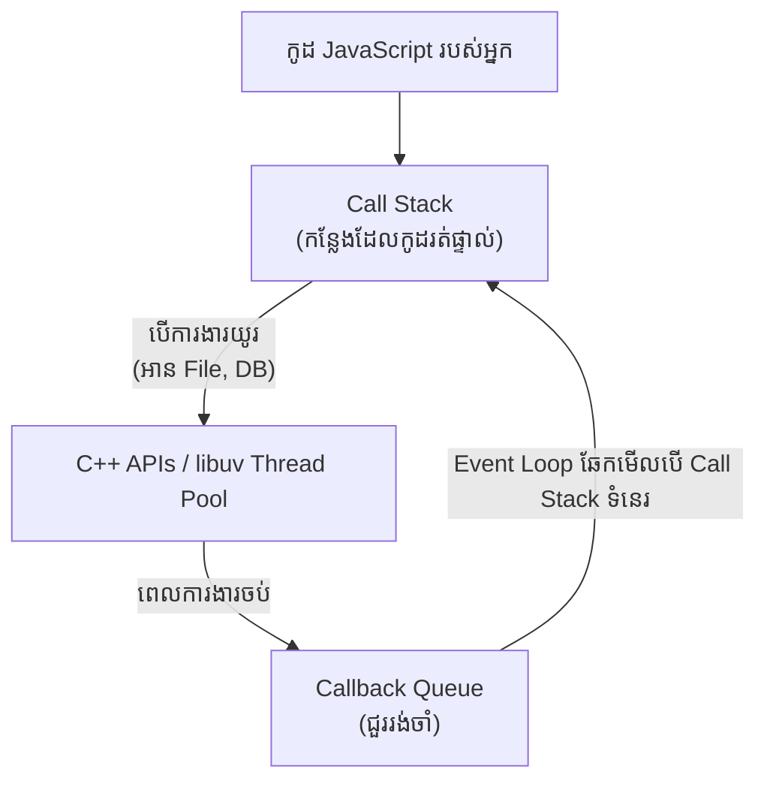

## 🎡 អ្វីទៅជា Event Loop?

**Event Loop** គឺជាបេះដូងរបស់ Node.js ដែលធ្វើអោយវាអាចមានសមត្ថភាព Non-blocking I/O បើទោះបីជាវាមានត្រឹមតែ Single-Thread ក៏ដោយ។
វាមានតួនាទីទទួលយកការងារ បញ្ជូនការងារដែលចំណាយពេលយូរទៅអោយប្រព័ន្ធកុំព្យូទ័រ (OS/libuv) ធ្វើ ហើយចាំយកលទ្ធផលត្រលប់មកវិញនៅពេលការងារនោះចប់។

### ដ្យាក្រាមដំណើរការរបស់ Event Loop



### ការអនុវត្តជាក់ស្តែង៖ តើកូដមួយណាដើរមុន?

តោះមើលឧទាហរណ៍ដ៏ពេញនិយមមួយ៖

```javascript
console.log("លេខ 1");

setTimeout(() => {
    console.log("លេខ 2 (ពី setTimeout)");
}, 0);

Promise.resolve().then(() => {
    console.log("លេខ 3 (ពី Promise)");
});

console.log("លេខ 4");
```

**លទ្ធផលដែលទទួលបាន៖**
1. `លេខ 1`
2. `លេខ 4`
3. `លេខ 3 (ពី Promise)`
4. `លេខ 2 (ពី setTimeout)`

**ហេតុអ្វីបានជាអញ្ចឹង?**
- លេខ 1 និង លេខ 4 ជាកូដធម្មតា (Synchronous) ទើបវាចូលដល់ Call Stack ហើយរត់ភ្លាមៗ។
- ទោះបីជា `setTimeout` កំណត់ពេល 0 វិនាទីក៏ដោយ ក៏វាត្រូវបានបញ្ជូនទៅរង់ចាំនៅក្នុង **MacroTask Queue**។
- ចំណែកឯ Promise ត្រូវបានបញ្ជូនទៅ **MicroTask Queue**។ 
- Event Loop តែងតែផ្តល់អាទិភាពអោយ MicroTask Queue ដើរមុន MacroTask Queue ជានិច្ច ទើបលេខ 3 ចេញមុនលេខ 2។
