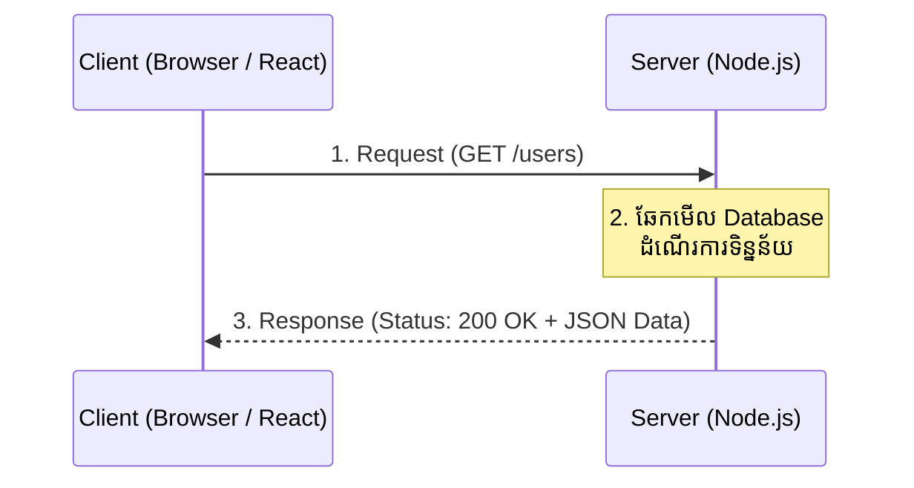

## 🌐 ពិភពនៃ HTTP

នៅលើអ៊ីនធឺណិត ការប្រាស្រ័យទាក់ទងគ្នារវាងកុំព្យូទ័រ (Client) ទៅកាន់ម៉ាស៊ីនមេ (Server) គឺធ្វើឡើងតាមរយៈពិធីការមួយឈ្មោះថា **HTTP (Hypertext Transfer Protocol)**។

វដ្តនៃដំណើរការនេះមានពីរផ្នែកសំខាន់ៗ៖
1. **Request (សំណើ):** Client (ឧទាហរណ៍៖ Browser, Mobile App) ផ្ញើសំណើទៅកាន់ Server។
2. **Response (ការឆ្លើយតប):** Server ទទួលសំណើ រួចធ្វើការគណនា ហើយបញ្ជូនទិន្នន័យ (ភាគច្រើនជា JSON) ត្រលប់ទៅអោយ Client វិញ។



### អ្វីខ្លះដែលមាននៅក្នុង Request?
- **Method (កិរិយាសព្ទ):** `GET` (ទាញយក), `POST` (បង្កើតថ្មី), `PUT/PATCH` (កែប្រែ), `DELETE` (លុប)។
- **URL/Path:** គោលដៅដែលចង់ទៅ (ឧ. `/api/users`)។
- **Headers:** ព័ត៌មានបន្ថែម (ឧ. ប្រភេទ Content, Token សម្រាប់សម្គាល់ខ្លួន)។
- **Body:** ទិន្នន័យដែលផ្ញើមក (មានតែចំពោះ POST/PUT ប៉ុណ្ណោះ)។

### អ្វីខ្លះដែលមាននៅក្នុង Response?
- **Status Code (លេខកូដសម្គាល់លទ្ធផល):**
  - `2xx`: ជោគជ័យ (ឧ. 200 OK, 201 Created)
  - `4xx`: កំហុសពីអ្នកប្រើ (ឧ. 400 Bad Request, 404 Not Found)
  - `5xx`: កំហុសពីម៉ាស៊ីន Server (ឧ. 500 Internal Server Error)
- **Headers & Body** (ទិន្នន័យ JSON ដែលផ្ញើត្រលប់ទៅវិញ)។

### ការបង្កើត Server ដំបូងដោយមិនប្រើ Framework

ទោះបីជានាពេលខាងមុខយើងនឹងប្រើប្រាស់ Express.js ដែលមានភាពងាយស្រួលក៏ដោយ ក៏វាសំខាន់ក្នុងការស្វែងយល់ពីរបៀបដែល Node.js បង្កើត Server ដោយខ្លួនឯងតាមរយៈ Module ស្តង់ដារ `http`។

**ឧទាហរណ៍ (server.js):**
```javascript
import http from 'http';

const server = http.createServer((req, res) => {
    // កំណត់ Response Header ថាទិន្នន័យនេះជា JSON
    res.setHeader('Content-Type', 'application/json');

    // ពិនិត្យមើល Path
    if (req.url === '/' && req.method === 'GET') {
        res.statusCode = 200;
        res.end(JSON.stringify({ message: "សួស្តីពី Node.js Server!" }));
    } 
    else if (req.url === '/api/users' && req.method === 'GET') {
        res.statusCode = 200;
        res.end(JSON.stringify([
            { id: 1, name: "សុខ" },
            { id: 2, name: "សៅ" }
        ]));
    } 
    else {
        // បើចូលខុស Path
        res.statusCode = 404;
        res.end(JSON.stringify({ error: "រកមិនឃើញទំព័រនេះទេ (404)" }));
    }
});

const PORT = 3000;
server.listen(PORT, () => {
    console.log(`🚀 Server កំពុងដើរនៅលើ http://localhost:${PORT}`);
});
```

> [!NOTE]
> ដូចអ្នកឃើញស្រាប់ ការសរសេរ Server ធម្មតាមានភាពស្មុគស្មាញច្រើន ព្រោះយើងត្រូវឆែកលក្ខខណ្ឌ `req.url` និង `req.method` គ្រប់កន្លែង។ ហេតុនេះហើយទើបនៅ Module ទី២ យើងនឹងចាប់ផ្តើមប្រើប្រាស់ **Express.js** ដែលជាអ្នកដោះស្រាយរឿងរញ៉េរញ៉ៃទាំងនេះអោយយើង!
