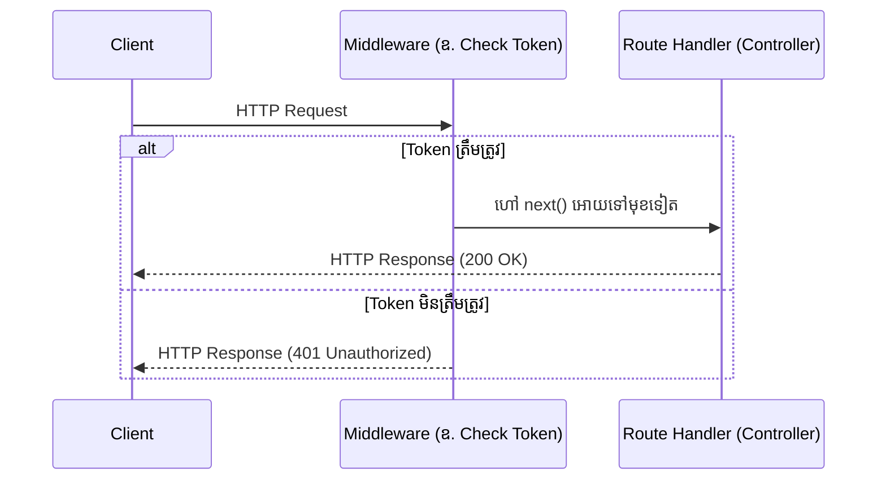

## 🛡️ អ្វីទៅជា Middleware?

**Middleware** គឺជា Function មួយដែលនៅចំកណ្តាលរវាង **Request** និង **Response**។ រាល់ពេលដែល Client ផ្ញើ Request មក វានឹងឆ្លងកាត់ Middleware ជាមុនសិន មុននឹងទៅដល់ Route របស់អ្នក។



### របៀបបង្កើត Custom Middleware

Middleware function តែងតែមានប៉ារ៉ាម៉ែត្រ ៣ ចម្បង: `(req, res, next)`។
ពាក្យបញ្ជា `next()` គឺសំខាន់បំផុត បើគ្មានវាទេ Request នឹងគាំងនៅនឹងកន្លែង។

```tabs
javascript
// app.js
import express from 'express';
  import { loggerMiddleware } from './middlewares/logger.js';
  import { checkAuth } from './middlewares/auth.js';

  const app = express();

  // ប្រើប្រាស់ Global Middleware (មានប្រសិទ្ធភាពលើគ្រប់ Route)
  app.use(loggerMiddleware);

  // ប្រើប្រាស់ Middleware សម្រាប់តែ Route មួយនេះប៉ុណ្ណោះ
  app.get('/dashboard', checkAuth, (req, res) => {
      res.json({ message: "សូមស្វាគមន៍មកកាន់ Dashboard លាក់កំបាំង!" });
  });

  app.listen(3000);
---
javascript
// middlewares/logger.js
// បង្កើត Middleware សម្រាប់កត់ត្រាការហៅ
  export const loggerMiddleware = (req, res, next) => {
      console.log(`[${new Date().toISOString()}] ${req.method} ${req.url}`);
      
      // បញ្ជូនទៅ Function បន្ទាប់
      next(); 
  };
---
javascript
// middlewares/auth.js
// បង្កើត Middleware សម្រាប់ត្រួតពិនិត្យសិទ្ធិ
  export const checkAuth = (req, res, next) => {
      const token = req.headers.authorization;
      
      if (token === "my_secret_token") {
          next(); // អនុញ្ញាតអោយទៅមុខទៀត
      } else {
          // បញ្ចប់ Request នៅទីនេះ ហើយបញ្ជូនកំហុសទៅវិញ
          res.status(401).json({ error: "អ្នកមិនមានសិទ្ធិចូលមើលទីនេះទេ!" });
      }
  };
```
