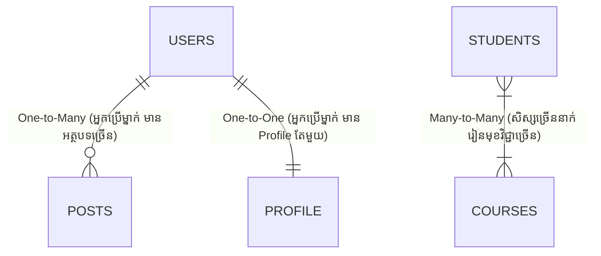

## 🔗 ទំនាក់ទំនងទិន្នន័យ (Relationships)

នៅក្នុងប្រព័ន្ធ Relational Database ទិន្នន័យត្រូវបានរក្សាទុកដាច់ពីគ្នាជាតារាងតូចៗ ដើម្បីកុំអោយមានការជាន់គ្នា (Data Redundancy)។ បន្ទាប់មក យើងប្រើ **Foreign Keys** ដើម្បីភ្ជាប់ពួកវាចូលគ្នាវិញ។

### ប្រភេទនៃទំនាក់ទំនងទាំង ៣



### របៀបបង្កើត Foreign Key និងការប្រើប្រាស់ JOIN

```tabs
sql
-- tables
-- តារាងមេ (Users)
  CREATE TABLE users (
      id SERIAL PRIMARY KEY,
      name VARCHAR(100)
  );

  -- តារាងកូន (Posts) ភ្ជាប់ទៅ Users
  CREATE TABLE posts (
      id SERIAL PRIMARY KEY,
      title VARCHAR(200),
      user_id INT,
      FOREIGN KEY (user_id) REFERENCES users(id) ON DELETE CASCADE
  );
---
sql
-- join
SELECT posts.title, users.name
  FROM posts
  JOIN users ON posts.user_id = users.id;
```
