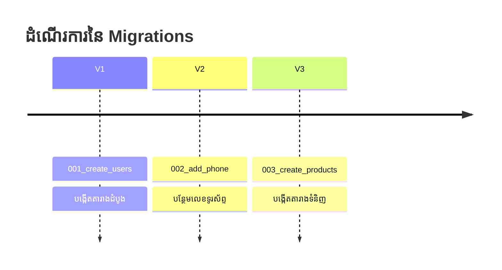

## 🏗️ បញ្ហានៃការផ្លាស់ប្តូររចនាសម្ព័ន្ធទិន្នន័យ

ស្រមៃថាអ្នកធ្វើការក្នុងក្រុមមួយមានគ្នាច្រើននាក់៖
- អ្នកបានសរសេរកូដ `ALTER TABLE users ADD COLUMN phone_number VARCHAR(15);` នៅក្នុង Database របស់អ្នក។
- បន្ទាប់មកអ្នក Push កូដ Node.js ថ្មីទៅកាន់ GitHub។
- មិត្តរួមក្រុមរបស់អ្នកទាញកូដមក Run ស្រាប់តែ Error ព្រោះ Database របស់គាត់អត់ទាន់មាន Column `phone_number` នោះទេ។

### អ្វីទៅជា Migration?

**Migration** ប្រៀបដូចជាប្រព័ន្ធគ្រប់គ្រង Version (Version Control ដូច Git ដែរ) ប៉ុន្តែសម្រាប់ Database។ 
វាអនុញ្ញាតអោយអ្នកសរសេរកូដផ្លាស់ប្តូរតារាង រួចចែកចាយកូដនោះទៅអ្នកផ្សេង។ ពេលពួកគេ Run Command ម្តង Database របស់ពួកគេនឹងផ្លាស់ប្តូរទៅជាទម្រង់ថ្មីដូចអ្នកដែរ។

> [!NOTE]
> ជំនួសអោយការសរសេរ Migration ដោយផ្ទាល់តាមរយៈ Raw SQL នៅក្នុង Module បន្ទាប់ យើងនឹងរៀនប្រើប្រាស់ **ORM (TypeORM ឫ Prisma)** ដែលមានភ្ជាប់មកជាមួយនូវប្រព័ន្ធ Migration យ៉ាងស្រួលប្រើ។ យើងនឹងទុកការអនុវត្តជាក់ស្តែងនៅ Module ក្រោយ!
