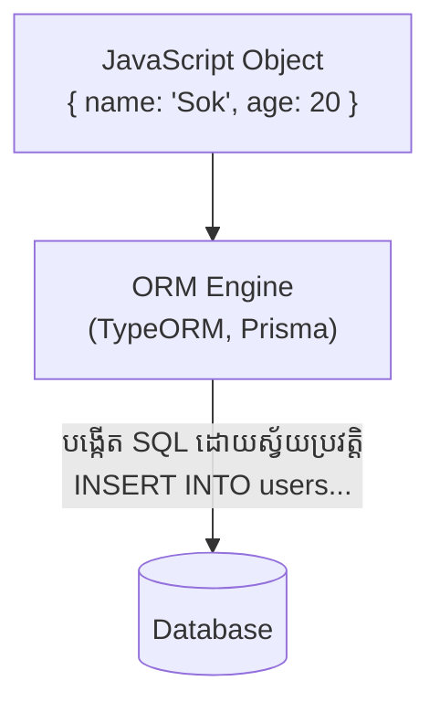

## 🎩 អ្វីទៅជា ORM?

**ORM (Object-Relational Mapping)** គឺជាបច្ចេកទេស ឬ Library មួយដែលបំប្លែងទិន្នន័យពីទម្រង់តារាង (Rows/Columns ក្នុង Database) មកជាទម្រង់ Object (របស់ JavaScript) វិញ ដើម្បីអោយយើងងាយស្រួលសរសេរកូដ។

### បញ្ហារបស់ Raw SQL
ពេលយើងប្រើ Raw SQL យើងត្រូវសរសេរកូដ SQL ជាទម្រង់អក្សរ (String) ដែលនាំអោយមានបញ្ហាធំពីរ៖
1. បើយើងវាយអក្សរខុស (Typo) កូដយើងនឹង Error តែពេលរត់ប៉ុណ្ណោះ។
2. យើងមិនមាន Type Hinting (ការចង្អុលបង្ហាញកូដដោយស្វ័យប្រវត្តិពី VS Code) ទេ។

### ដំណោះស្រាយពី ORM



**ឧទាហរណ៍ប្រៀបធៀប៖**

```tabs
javascript
// raw
// មិនមាន Type Hinting, ប្រឈមនឹងការសរសេរខុស
  const result = await pool.query(
      'SELECT * FROM users WHERE age > $1 AND status = $2', 
      [18, 'active']
  );
  const users = result.rows;
---
javascript
// orm
// VS Code នឹងលោតអោយរើសដោយស្វ័យប្រវត្តិ!
  const users = await User.find({
      where: {
          age: MoreThan(18),
          status: 'active'
      }
  });
```

> [!WARNING]  
> "បើដូរពី Postgres ទៅ MySQL មិនបាច់សរសេរកូដឡើងវិញទេ" - ពាក្យនេះ **មិនត្រឹមត្រូវ ១០០% ទេ**។ ទោះបីជា ORM ជួយសម្រួលការប្តូរ Database មែន ប៉ុន្តែបើអ្នកប្រើប្រាស់មុខងារពិសេសៗរបស់ Database (ដូចជា JSONB របស់ Postgres) ពេលប្តូរទៅ MySQL វានៅតែមានបញ្ហាដដែល។
