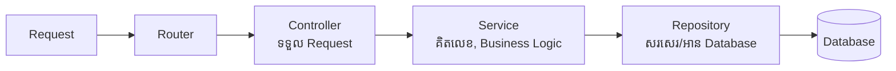

## 🏛️ ការរចនារចនាសម្ព័ន្ធកូដ (Architecture)

ប្រសិនបើយើងសរសេរកូដទាក់ទង Database ផ្ទាល់នៅក្នុង Express Controller កូដរបស់យើងនឹងមានភាពរញ៉េរញ៉ៃ។
យើងនឹងអនុវត្តតាមទម្រង់ដ៏ពេញនិយមគឺ **Controller → Service → Repository**។



```tabs
javascript
// repositories/userRepository.js
import { AppDataSource } from '../config/database.js';
  import { User } from '../entities/User.js';

  // ទាញយក Repository ផ្ទាល់ពី TypeORM
  const userRepository = AppDataSource.getRepository(User);

  // បង្កើត Function សាមញ្ញៗ
  export const findUserByEmail = async (email) => {
      return await userRepository.findOneBy({ email });
  };

  export const createUser = async (userData) => {
      const user = userRepository.create(userData);
      return await userRepository.save(user);
  };
---
javascript
// services/userService.js
import { findUserByEmail, createUser } from '../repositories/userRepository.js';
  // Service ជាកន្លែងឆែកលក្ខខណ្ឌ (Business Logic)
  
  export const registerUser = async (email, password) => {
      const existingUser = await findUserByEmail(email);
      if (existingUser) {
          throw new Error("អុីមែលនេះមានរួចហើយ!");
      }
      
      // TODO: យើងនឹងរៀន Hashing លេខសម្ងាត់នៅ Module ក្រោយ!
      return await createUser({ email, password });
  };
---
javascript
// controllers/authController.js
import { registerUser } from '../services/userService.js';
  // Controller មានតួនាទីត្រឹមតែទទួល req, res ប៉ុណ្ណោះ
  
  export const register = async (req, res, next) => {
      try {
          const { email, password } = req.body;
          const user = await registerUser(email, password);
          
          res.status(201).json({ success: true, data: user });
      } catch (error) {
          next(error); // បញ្ជូនទៅ Global Error Handler
      }
  };
```
