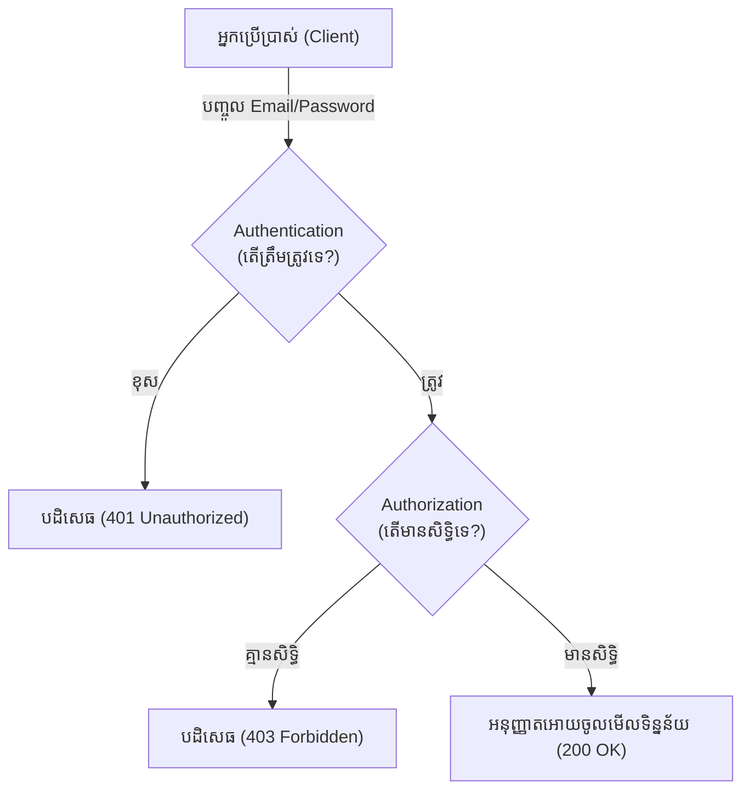

## 🔑 Authentication (AuthN) ទល់នឹង Authorization (AuthZ)

នៅក្នុងការបង្កើតប្រព័ន្ធសុវត្ថិភាពសម្រាប់ Backend ពាក្យពីរនេះតែងតែត្រូវបានគេប្រើប្រាស់ញឹកញាប់ ប៉ុន្តែវាមានអត្ថន័យខុសគ្នាស្រឡះ។

### 1. Authentication (ការបញ្ជាក់អត្តសញ្ញាណ)
**សំនួរ:** តើអ្នកជានរណា? (Who are you?)
នេះគឺជាដំណើរការផ្ទៀងផ្ទាត់ថា អ្នកពិតជាមនុស្សដែលអ្នកបានអះអាងមែន។
*ឧទាហរណ៍:* ការបញ្ចូល Email និង Password ត្រឹមត្រូវដើម្បី Login ចូលប្រព័ន្ធ។

### 2. Authorization (ការផ្តល់សិទ្ធិ)
**សំនួរ:** តើអ្នកមានសិទ្ធិធ្វើអ្វីខ្លះ? (What are you allowed to do?)
នេះគឺជាដំណើរការកំណត់ថា តើអ្នកត្រូវបានអនុញ្ញាតអោយមើល ឬកែប្រែទិន្នន័យជាក់លាក់ណាមួយដែរឬទេ។
*ឧទាហរណ៍:* ថ្វីត្បិតតែអ្នកបាន Login (Authentication) ក៏ពិតមែន ប៉ុន្តែអ្នកគ្មានសិទ្ធិលុបទិន្នន័យអ្នកដទៃចេញពីប្រព័ន្ធនោះទេ លុះត្រាតែអ្នកជា Admin (Authorization)។

