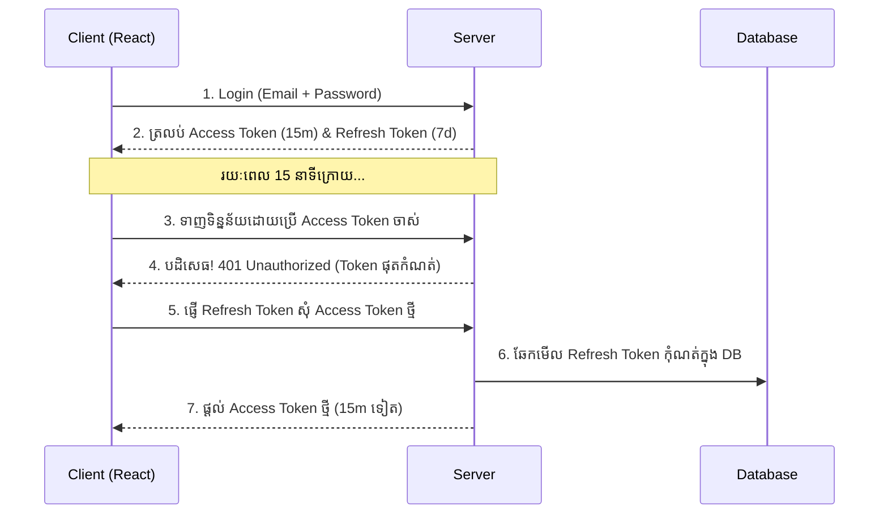

## 🔄 បញ្ហានៃការប្រើប្រាស់ Token តែមួយ

បើអ្នកកំណត់អោយ JWT (Access Token) មានអាយុកាលវែងពេក (ឧទាហរណ៍ ៣០ ថ្ងៃ) នោះបើសិនជា Hacker លួច Token នោះបាន គេអាចប្រើប្រាស់គណនីរបស់អ្នកបានរហូតដល់ ៣០ ថ្ងៃ។
បើអ្នកកំណត់អោយវាមានអាយុកាលខ្លីពេក (១៥ នាទី) នោះអ្នកប្រើប្រាស់នឹងត្រូវវាយបញ្ចូលលេខសម្ងាត់ដើម្បី Login ម្តងទៀតរៀងរាល់ ១៥ នាទី ដែលជាការរំខានយ៉ាងខ្លាំង។

### ដំណោះស្រាយ: Token ២ ប្រភេទ!

1. **Access Token (អាយុខ្លី - 15 នាទី):** 
   - ជា Token ស្តង់ដារដែលផ្ញើទៅ Server គ្រប់ Request។
   - ត្រូវរក្សាទុកក្នុងកន្លែងមានសុវត្ថិភាព ឬក្នុង Memory (មិនគួរទុកក្នុង `localStorage` ទេ ដើម្បីការពារ XSS)។

2. **Refresh Token (អាយុវែង - 7 ថ្ងៃ):**
   - ប្រើសម្រាប់តែយកទៅប្តូរយក Access Token ថ្មីប៉ុណ្ណោះ។
   - ត្រូវរក្សាទុកនៅក្នុង **HttpOnly Cookies** (ការពារមិនអោយ JavaScript ពីខាងក្រៅអានបាន)។
   - ត្រូវ Save ទុកក្នុង Database របស់ Server ដើម្បី Server អាចលុបវាចោល (Revoke) បានពេលចង់បញ្ឈប់សិទ្ធិ ឬពេលអ្នកប្រើប្រាស់ Logout។
