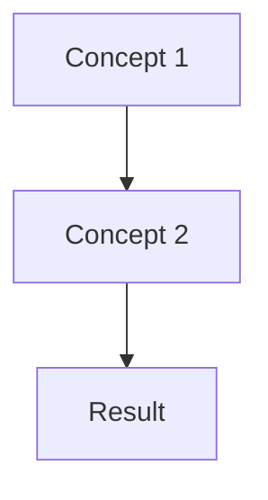

## 🚀 អំពីមេរៀននេះ (Protected Routes)

នៅក្នុងមេរៀននេះ យើងនឹងរៀនអំពី **Protected Routes**។

### យន្តការ (Concept Diagram)

> [!NOTE]
> ខ្លឹមសារលម្អិតនឹងត្រូវបានបន្ថែមនាពេលខាងមុខ។

### ការអនុវត្តជាក់ស្តែង (Lab Exercise)

- បង្កើត Project ថ្មី
- សរសេរកូដសម្រាប់ Protected Routes
