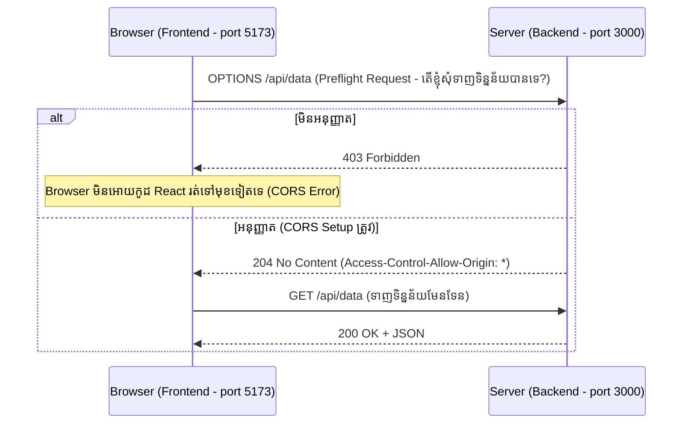

## 🚧 អ្វីទៅជា CORS?

**CORS (Cross-Origin Resource Sharing)** គឺជាយន្តការសុវត្ថិភាពដែលបង្កើតឡើងដោយ Browser មិនមែនដោយ Server ទេ។
តាមលំនាំដើម Browser នឹងរារាំងមិនអោយគេហទំព័រមួយ (ឧ. `frontend.com`) ទាញទិន្នន័យពី API មួយផ្សេងទៀត (ឧ. `backend.com`) ទេ លុះត្រាតែ API នោះមានការអនុញ្ញាត (បញ្ជូន CORS Header ត្រលប់មកវិញ)។



### របៀបកំណត់ CORS នៅក្នុង Express

```bash
npm install cors
```

```tabs
javascript
// app.js
import express from 'express';
import cors from 'cors';

const app = express();

// 1. បើកអោយអ្នកគ្រប់គ្នាចូលបាន (កុំប្រើបែបនេះសម្រាប់ Production API របស់អ្នក!)
// app.use(cors()); 

// 2. ការកំណត់ដែលត្រឹមត្រូវ និងមានសុវត្ថិភាព (Best Practice)
const corsOptions = {
    origin: process.env.NODE_ENV === 'production' 
        ? ['https://www.mydomain.com', 'https://admin.mydomain.com'] // អនុញ្ញាតតែ Domain ផ្លូវការប៉ុណ្ណោះ
        : 'http://localhost:5173', // សម្រាប់ពេល Development (React/Vite)
    methods: ['GET', 'POST', 'PUT', 'DELETE'], // អនុញ្ញាតតែ Methods ប៉ុណ្ណេះ
    credentials: true // អនុញ្ញាតអោយបញ្ជូន Cookies ឆ្លង Domain (សំខាន់បើប្រើ Refresh Token!)
};

app.use(cors(corsOptions));
```
