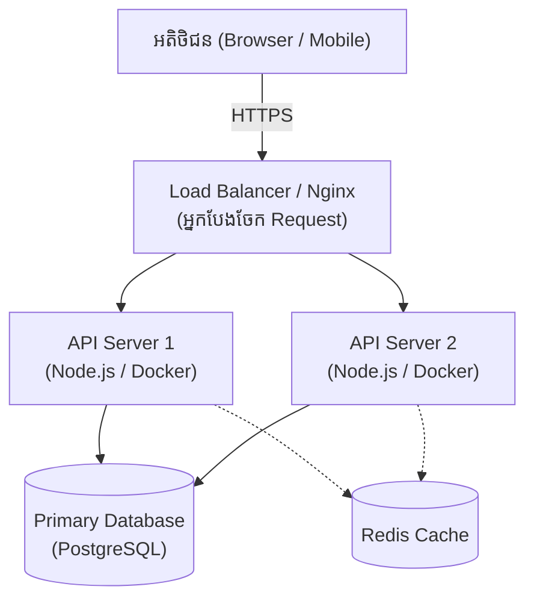

## 🚀 របៀបដែលប្រព័ន្ធដំណើរការលើ Production

នៅពេលយើង Deploy កម្មវិធីខ្នាតធំ វាមានរចនាសម្ព័ន្ធស្មុគស្មាញជាងកុំព្យូទ័រផ្ទាល់ខ្លួនយើងឆ្ងាយណាស់។ នេះជាសមាសធាតុសំខាន់ៗដែលអ្នកគួរដឹង៖

### ជំរើសក្នុងការ Deploy កម្មវិធី Node.js

1. **PaaS (Platform as a Service):** 
   - ងាយស្រួលបំផុត មិនបាច់ខ្វល់ពី Server (ឧ. Render, Heroku, Railway)។
   - គ្រាន់តែភ្ជាប់ GitHub វានឹង Deploy ដោយស្វ័យប្រវត្តិ។ កម្រៃរាងថ្លៃបន្តិចពេលមានអ្នកប្រើច្រើន។
2. **VPS (Virtual Private Server):** 
   - ថោក តែពិបាករៀបចំខ្លួនឯង (ឧ. DigitalOcean, AWS EC2, Linode)។
   - អ្នកត្រូវតម្លើង Nginx, Docker និងគ្រប់គ្រងសុវត្ថិភាព Server ដោយខ្លួនឯង។
3. **Container/Serverless Services:** 
   - សម្រាប់ប្រព័ន្ធធំៗ (AWS ECS, Google Cloud Run)។ ស៊ីលុយតាមការប្រើប្រាស់ពិតប្រាកដ។

> [!TIP]
> សម្រាប់ Project ដាក់ក្នុង Portfolio ឬ Project ខ្នាតតូច ខ្ញុំសូមណែនាំអោយប្រើប្រាស់ **Render.com** ឬ **Railway.app** ព្រោះវាងាយស្រួល និងមាន Free Tier សម្រាប់សាកល្បង។
