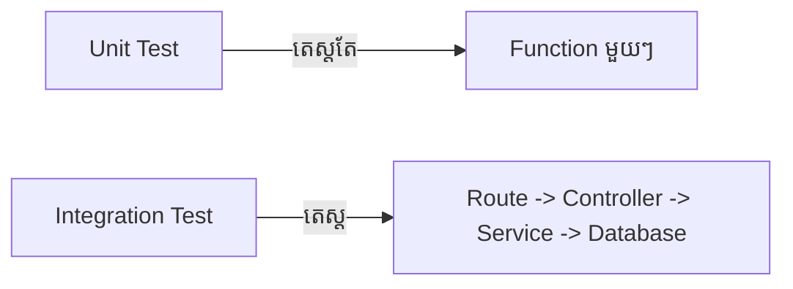

## 🧩 អ្វីទៅជា Integration Testing?

ខុសពី Unit Test ដែលតេស្តតែ Function ឯកកោ, **Integration Test** តេស្តមើលថាតើ Controller អាចនិយាយគ្នាជាមួយ Service ហើយ Service អាចនិយាយជាមួយ Repository (Database) បានត្រឹមត្រូវឬទេ។



### ការប្រើប្រាស់ Supertest

ដើម្បីធ្វើតេស្ត Route របស់ Express ដោយមិនចាំបាច់បើក Server ផ្ទាល់ យើងប្រើប្រាស់ Library ដែលមានឈ្មោះថា **Supertest**។

```bash
npm install --save-dev supertest
```

```tabs
javascript
// tests/integration/userApi.test.js
import request from 'supertest';
import app from '../../src/app.js'; // កម្មវិធី Express របស់អ្នក
import { AppDataSource } from '../../src/config/database.js';

describe('User API', () => {
    
    // បើក Database មុនពេលតេស្តទាំងអស់ចាប់ផ្តើម
    beforeAll(async () => {
        await AppDataSource.initialize();
    });

    // បិទ Database វិញពេលតេស្តចប់
    afterAll(async () => {
        await AppDataSource.destroy();
    });

    it('គួរតែបង្កើត User ថ្មីបាននៅពេលបញ្ជូនទិន្នន័យត្រឹមត្រូវ', async () => {
        const res = await request(app)
            .post('/api/users')
            .send({
                name: "សិស្ស",
                email: "student@test.com",
                password: "password123"
            });
        
        expect(res.statusCode).toBe(201);
        expect(res.body.success).toBe(true);
        expect(res.body.data.email).toBe("student@test.com");
    });
});
```
