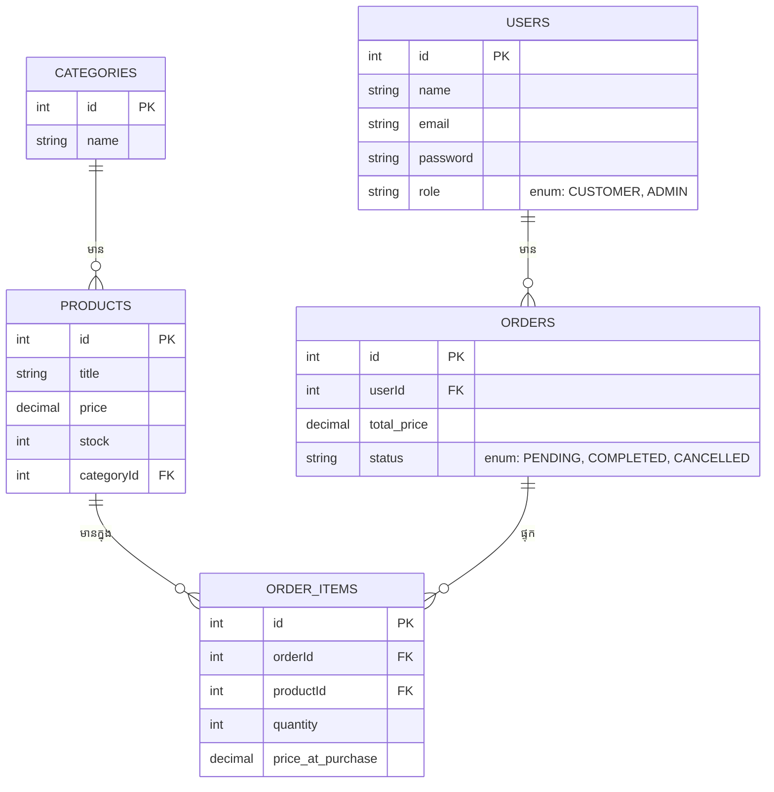

## 🎓 គម្រោងបញ្ចប់ការសិក្សា (Capstone Project)

មកដល់ចំណុចនេះ អ្នកបានសិក្សាគ្រប់គ្រាន់ពីការសាងសង់ Backend ប្រកបដោយស្តង់ដារ និងសុវត្ថិភាពខ្ពស់ហើយ។ ដល់ពេលដែលអ្នកត្រូវយកវាទាំងអស់មកផ្គុំគ្នា ដើម្បីបង្កើតគម្រោងពិតប្រាកដមួយ។

### អំពីគម្រោង៖ ប្រព័ន្ធគ្រប់គ្រងការលក់ទំនិញអនឡាញ (E-Commerce REST API)

អ្នកត្រូវសាងសង់ Backend សម្រាប់ App លក់ទំនិញ ដែលមានសមត្ថភាពដូចខាងក្រោម៖

1. **Authentication:** អាច Login, Register ជាមួយ JWT (Access & Refresh tokens)។
2. **Products Management:** Admin អាចបន្ថែម កែប្រែ លុបទំនិញ។ អ្នកទិញអាចមើល ស្វែងរក (Search) និងត្រង (Filter) តាមតម្លៃ ឫប្រភេទ។
3. **Shopping Cart & Orders:** អ្នកទិញអាចបញ្ជាទិញទំនិញ គណនាតម្លៃសរុប។
4. **Roles:** មាន `Admin` (អ្នកគ្រប់គ្រង) និង `Customer` (អ្នកទិញធម្មតា)។

### រចនាសម្ព័ន្ធទិន្នន័យ (Database ERD)

### ជំហាននៃការសាងសង់ (Implementation Checklist)

- [ ] រៀបចំរចនាសម្ព័ន្ធ Folder (Controller, Service, Repository)
- [ ] រៀបចំ Database Connection (TypeORM)
- [ ] បង្កើត Entities និង Relationships
- [ ] បង្កើត Auth Module (Register, Login ជាមួយ bcrypt និង JWT)
- [ ] បង្កើត Middleware ការពារ Route (Auth, Role, Rate Limiter)
- [ ] បង្កើត Products API (ប្រើ QueryBuilder សម្រាប់ Pagination និវ Search)
- [ ] បង្កើត Order API (ប្រើប្រាស់ Transactions ពេលកាត់ស្តុកទំនិញ)
- [ ] សរសេរ Unit / Integration Tests ខ្លះៗ
- [ ] Deploy ទៅកាន់ Render ឫ Railway

> នេះមិនមែនជារឿងងាយស្រួលទេ វានឹងទាមទារការអត់ធ្មត់ខ្ពស់ និងការត្រលប់ទៅមើលមេរៀនចាស់ៗឡើងវិញ។ **សូមសំណាងល្អ!** 🚀
