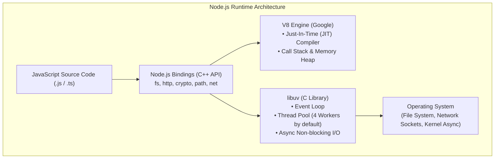

## 🚀 អ្វីទៅជា Node.js?

**Node.js** មិនមែនជាភាសា Programming ថ្មីទេ ហើយក៏មិនមែនជា Framework ដែរ។ វាគឺជា **JavaScript Runtime Environment** បង្កើតឡើងដោយ Ryan Dahl ក្នុងឆ្នាំ ២០០៩ ដោយយក **V8 Engine** របស់ Google Chrome មកផ្សំជាមួយ Library **libuv** (សរសេរដោយភាសា C/C++)។

មុនពេលមាន Node.js, JavaScript អាចរត់បានតែនៅក្នុង Web Browser ប៉ុណ្ណោះ (ដូចជា Chrome, Firefox, Safari) សម្រាប់តែ Client-side UI។ Node.js បាននាំយក JavaScript មកកាន់ពិភព **Backend, Desktop Utilities, Microservices, និង Cloud Computing**។



---

## ⚙️ សមាសភាគស្នូលទាំង ២ របស់ Node.js

### 1. Google V8 Engine
- បំប្លែងកូដ JavaScript ទៅជា **Machine Code (Assembly/Binary)** ដោយផ្ទាល់តាមរយៈបច្ចេកវិទ្យា **JIT (Just-In-Time) Compilation**។
- គ្រប់គ្រង Memory Heap (ការបែងចែកអង្គចងចាំ) និង Call Stack (ការដំណើរការអនុគមន៍)។

### 2. libuv Library
- ផ្តល់នូវយន្តការ **Event Loop** និង **Thread Pool**។
- ទទួលខុសត្រូវលើប្រតិបត្តិការ **Asynchronous I/O** ដូចជាការអាន/សរសេរ Files, ទទួល Network Requests, និងការភ្ជាប់ Database ដោយមិនរារាំង (Non-blocking) Thread មេ។

---

## 💡 ហេតុអ្វី Node.js ពេញនិយមក្នុងវិស័យ Backend?

| លក្ខណៈពិសេស | ការពិពណ៌នា | អត្ថប្រយោជន៍ជាក់ស្តែង |
|---|---|---|
| **Unified Language** | ប្រើ JavaScript/TypeScript ទាំង Frontend និង Backend | ក្រុមការងារ Full-Stack ងាយស្រួល Share Types និង Logic |
| **Non-blocking I/O** | មិនរង់ចាំប្រតិបត្តិការយឺត (Disk/Network) | ទ្រទ្រង់ Concurrent Connections បានរាប់ម៉ឺនក្នុងពេលតែមួយ |
| **NPM Ecosystem** | ឃ្លាំងកញ្ចប់កូដធំជាងគេលើពិភពលោក (ជាង ២ លាន packages) | សម្បូរ Tools, SDKs, និង Libraries ស្រាប់ៗ |
| **High Throughput** | ស៊ី Memory ទាប និង Startup Time លឿន | ស័ក្តិសមបំផុតសម្រាប់ REST APIs, GraphQL, Microservices, Real-time Chat |

> [!TIP]
> **Pro Insight:** Node.js មាន **Single-threaded Event Loop** សម្រាប់ JavaScript Execution ប៉ុន្តែនៅពីក្រោយខ្នង វាប្រើ **Multi-threaded Worker Pool** (libuv) សម្រាប់ប្រតិបត្តិការធ្ងន់ៗដូចជា File System, Cryptography, និង DNS Lookup។

---

## 🛠️ ការអនុវត្តជាក់ស្តែង (Lab Exercise)

តោះសាកល្បងពិនិត្យមើលព័ត៌មាន Runtime Environment នៅលើម៉ាស៊ីនរបស់អ្នក៖

### ជំហានទី ១: បង្កើតឯកសារ `runtime-test.js`
```javascript
console.log("🚀 Welcome to Backend Engineering with Node.js!");
console.log("---------------------------------------------");
console.log("Node.js Version :", process.version);
console.log("Platform        :", process.platform);
console.log("Architecture    :", process.arch);
console.log("Memory Usage    :", Math.round(process.memoryUsage().heapUsed / 1024 / 1024), "MB");
console.log("Process ID (PID):", process.pid);
```

### ជំហានទី ២: ដំណើរការកូដក្នុង Terminal
```bash
node runtime-test.js
```
