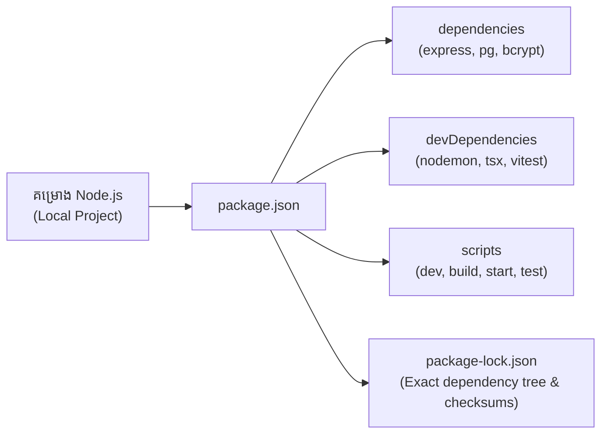

## 📦 អ្វីទៅជា NPM?

**NPM (Node Package Manager)** គឺជាកន្លែងផ្ទុកកញ្ចប់កូដ (Packages/Libraries) បើកចំហររបស់ JavaScript ធំបំផុតនៅលើពិភពលោក។ NPM រួមមាន ៣ ផ្នែកធំៗ៖
1. **NPM Website:** កន្លែងស្វែងរក packages (`npmjs.com`)។
2. **NPM Registry:** Database សាធារណៈផ្ទុកកូដ និង versions ទាំងអស់។
3. **NPM CLI:** ឧបករណ៍បញ្ជាតាម Command Line ក្នុងម៉ាស៊ីនរបស់យើង។



---

## 📄 រចនាសម្ព័ន្ធឯកសារ `package.json`

ឯកសារ `package.json` គឺជា **Manifest / អត្តសញ្ញាណប័ណ្ណ** នៃគម្រោង Backend របស់អ្នក៖

```json
{
  "name": "ecommerce-backend-api",
  "version": "1.0.0",
  "type": "module",
  "main": "dist/index.js",
  "scripts": {
    "dev": "tsx watch src/index.ts",
    "build": "tsc",
    "start": "node dist/index.js",
    "test": "vitest run"
  },
  "dependencies": {
    "express": "^4.19.2",
    "pg": "^8.11.5",
    "dotenv": "^16.4.5"
  },
  "devDependencies": {
    "@types/express": "^4.17.21",
    "@types/node": "^20.12.7",
    "tsx": "^4.7.2",
    "typescript": "^5.4.5"
  }
}
```

---

## 🔢 Semantic Versioning (SemVer)

លេខ Version ក្នុង Node.js ដើរតាមទម្រង់ **MAJOR.MINOR.PATCH** (ឧទាហរណ៍៖ `4.19.2`)៖

| សញ្ញា | ឧទាហរណ៍ | អត្ថន័យ |
|---|---|---|
| **Caret (`^`)** | `^4.19.2` | អនុញ្ញាត Update រាល់ MINOR និង PATCH ថ្មីៗ (ឧ. 4.20.0, 4.19.3) ដរាបណា MAJOR នៅលេខ 4 ដដែល |
| **Tilde (`~`)** | `~4.19.2` | អនុញ្ញាត Update តែ PATCH bug fixes ប៉ុណ្ណោះ (ឧ. 4.19.3, 4.19.4) |
| **Exact** | `4.19.2` | ដំឡើង Version នេះសុទ្ធសាធ គ្មានការ Update ដោយស្វ័យប្រវត្តិ |

---

## 🔒 សារៈសំខាន់របស់ `package-lock.json`

> [!IMPORTANT]
> ឯកសារ `package-lock.json` កត់ត្រា Version ពិតប្រាកដ និង Cryptographic Hash (SHA-512) នៃ Dependency គ្រប់កម្រិត (Sub-dependencies)។
> - **ត្រូវតែ Commit** ឯកសារ `package-lock.json` ចូលក្នុង Git។
> - ពេល Deploy លើ Production Server ត្រូវប្រើ `npm ci` (Clean Install) ជំនួសឱ្យ `npm install` ដើម្បីការពារបញ្ហា Version ប្លែកគ្នា។

---

## 🛠️ ការអនុវត្តជាក់ស្តែង (Lab Exercise)

1. បង្កើតគម្រោងថ្មី និងបង្កើត `package.json` ដោយស្វ័យប្រវត្តិ៖
   ```bash
   mkdir backend-lab && cd backend-lab
   npm init -y
   ```

2. បន្ថែម `"type": "module"` ទៅក្នុង `package.json` ដើម្បីប្រើ Modern ES Modules។

3. ដំឡើង Library សម្រាប់ Production និង Development៖
   ```bash
   # Production Dependency
   npm install chalk dotenv
   
   # Development Dependency
   npm install -D nodemon
   ```
