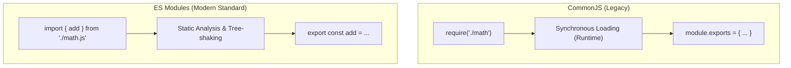

## 🧩 អ្វីទៅជា Module System?

នៅក្នុងការសរសេរកម្មវិធីខ្នាតធំ យើងមិនអាចសរសេរកូដទាំងអស់ក្នុង file តែមួយបានទេ។ យើងបំបែកកូដជាឯកសារតូចៗដែលមានមុខងារដាច់ដោយឡែកពីគ្នា (**Separation of Concerns**)។

នៅក្នុង Node.js មាន Module Systems សំខាន់ពីរ៖
1. **CommonJS (CJS):** ប្រព័ន្ធដើមរបស់ Node.js (តាំងពីឆ្នាំ ២០០៩) ប្រើ `require()` និង `module.exports`។
2. **ES Modules (ESM):** ស្តង់ដារផ្លូវការរបស់ JavaScript (ចាប់តាំងពី ES6/2015) ប្រើ `import` និង `export`។

---

## ⚖️ ការប្រៀបធៀប CJS vs ESM



| លក្ខណៈសម្បត្តិ | CommonJS (CJS) | ES Modules (ESM) |
|---|---|---|
| **Syntax** | `const pkg = require('./file')` | `import pkg from './file.js'` |
| **Export** | `module.exports = { ... }` | `export { ... }` ឬ `export default ...` |
| **Loading** | Synchronous (រារាំងពេល load) | Asynchronous & Static parsing |
| **Tree Shaking** | ពិបាក Optimize | ងាយស្រួល Optimize និងកាត់ Dead Code |
| **File Extension** | `.cjs` ឬ `.js` (default) | `.mjs` ឬ `.js` (បើកំណត់ `"type": "module"`) |
| **Globals** | មាន `__dirname` និង `__filename` | ប្រើ `import.meta.url` និង `fileURLToPath` |

---

## 💻 ឧទាហរណ៍ជាក់ស្តែងនៃ Modern ESM

### 1. ការបង្កើត Module (`src/utils/math.js`)
```javascript
// Named Exports
export const add = (a, b) => a + b;
export const multiply = (a, b) => a * b;

// Default Export
const logger = (msg) => console.log(`[MATH LOG]: ${msg}`);
export default logger;
```

### 2. ការទាញយកមកប្រើ (`src/app.js`)
```javascript
import logger, { add, multiply } from './utils/math.js';

logger("Calculating values...");
console.log("Sum:", add(10, 20));
console.log("Product:", multiply(4, 5));
```

---

## 💡 ការដោះស្រាយ `__dirname` ក្នុង ES Modules

នៅក្នុង ES Modules, អញ្ញត្តិ `__dirname` និង `__filename` មិនមានវត្តមានដោយស្វ័យប្រវត្តិដូច CommonJS ឡើយ។ ខាងក្រោមនេះជារបៀបបង្កើតពួកវាឡើងវិញ៖

```javascript
import path from 'path';
import { fileURLToPath } from 'url';

const __filename = fileURLToPath(import.meta.url);
const __dirname = path.dirname(__filename);

console.log("Current Directory:", __dirname);
console.log("Current File     :", __filename);
```

> [!TIP]
> សម្រាប់គម្រោង Backend ទំនើបៗ យើងតែងតែកំណត់ `"type": "module"` ក្នុង `package.json` ឬប្រើ **TypeScript** ដែល compile ESM ដោយផ្ទាល់។
