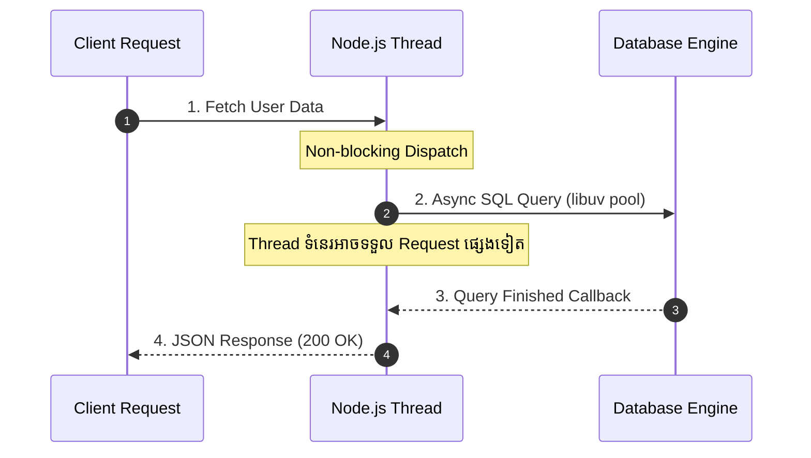

## ⏳ ហេតុអ្វី Backend ត្រូវការ Asynchronous?

នៅក្នុង Node.js, ស្ទើរតែរាល់ប្រតិបត្តិការ Backend ទាំងអស់សុទ្ធតែទាមទារ **I/O (Input/Output)**៖
- ការ Query ទិន្នន័យពី PostgreSQL / MongoDB
- ការអាន/សរសេរ Files លើ Disk
- ការហៅ API ទៅកាន់ 3rd-party Services (Stripe, Twilio, SendGrid)

ប្រសិនបើយើងសរសេរកូដបែប **Synchronous (Blocking)** នោះម៉ាស៊ីន Server នឹងត្រូវគាំងរង់ចាំការងារមួយៗចប់ ទើបអាចទទួល Request របស់អ្នកប្រើប្រាស់ផ្សេងទៀតបាន។



---

## 🚀 ដំណាក់កាលវិវត្តន៍នៃ Async Code

### 1. Callback Hell (❌ បុរាណ និងពិបាកគ្រប់គ្រង)
```javascript
getUser(userId, (err, user) => {
  if (err) return handleError(err);
  getOrders(user.id, (err, orders) => {
    if (err) return handleError(err);
    getOrderDetails(orders[0].id, (err, details) => {
      if (err) return handleError(err);
      console.log(details);
    });
  });
});
```

### 2. Promises Chaining (⚠️ ប្រសើរជាងមុន ប៉ុន្តែនៅតែបន្តបន្ទាត់វែង)
```javascript
getUser(userId)
  .then((user) => getOrders(user.id))
  .then((orders) => getOrderDetails(orders[0].id))
  .then((details) => console.log(details))
  .catch((err) => console.error("Error:", err.message));
```

### 3. Async / Await (✅ ស្តង់ដារទំនើប ស្អាត និងងាយស្រួលអានបំផុត)
```javascript
async function getCustomerSummary(userId) {
  try {
    const user = await getUser(userId);
    const orders = await getOrders(user.id);
    const details = await getOrderDetails(orders[0].id);
    return { user, orders, details };
  } catch (error) {
    console.error("Failed to load customer summary:", error.message);
    throw error;
  }
}
```

---

## ⚡ ការដំណើរការ Asynchronous ច្រើនក្នុងពេលតែមួយ (Parallel Execution)

កំហុសទូទៅរបស់អ្នកចាប់ផ្តើមដំបូង គឺការដាក់ `await` បន្តគ្នា ដែលធ្វើឱ្យកូដរង់ចាំម្តងមួយៗ (Sequential) ដោយមិនចាំបាច់៖

```javascript
// ❌ យឺត៖ សរុបចំណាយពេល = 100ms + 100ms + 100ms = 300ms
const users = await fetchUsers();
const products = await fetchProducts();
const categories = await fetchCategories();

// ✅ លឿនបំផុត៖ រត់ដំណាលគ្នា សរុបចំណាយពេល = Max(100ms, 100ms, 100ms) = 100ms
const [users, products, categories] = await Promise.all([
  fetchUsers(),
  fetchProducts(),
  fetchCategories()
]);
```

> [!TIP]
> ប្រើ **`Promise.allSettled()`** ប្រសិនបើអ្នកចង់ឱ្យ tasks ទាំងអស់ដំណើរការចប់ ទោះបីជាមាន task ខ្លះ fail ក៏មិនបណ្តាលឱ្យ tasks ផ្សេងទៀត reject ដែរ។
