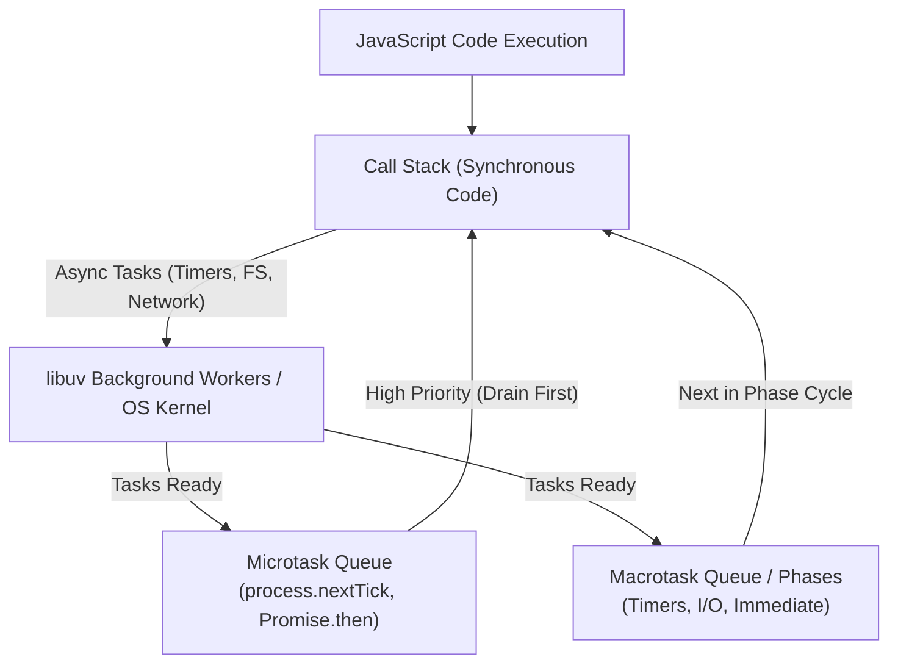
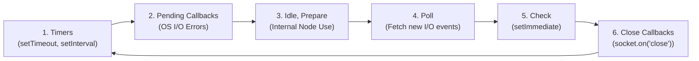

## 🎡 អ្វីទៅជា Event Loop?

**Event Loop** គឺជាបេះដូងរបស់ Node.js ដែលធ្វើឱ្យ Single-Threaded JavaScript អាចសម្រេចកិច្ចការ **High Concurrency** បាន។ វាត្រួតពិនិត្យ **Call Stack** ជាបន្តបន្ទាប់ ហើយនៅពេលដែល Call Stack ទំនេរ វាទាញយក Callbacks ពី Queues មកដំណើរការ។



---

## 🔄 ៦ ដំណាក់កាល (Phases) នៃ Event Loop ក្នុង libuv

រាល់ Loop មួយជុំ (Tick) ឆ្លងកាត់ដំណាក់កាលទាំងនេះតាមលំដាប់លំដោយ៖



1. **Timers Phase:** ដំណើរការ callbacks របស់ `setTimeout()` និង `setInterval()` ដែលដល់កំណត់។
2. **Pending Callbacks:** ដំណើរការ I/O callbacks មួយចំនួនដែលសេសសល់ពីជុំមុន។
3. **Idle, Prepare:** ប្រើប្រាស់សម្រាប់តែប្រព័ន្ធខាងក្នុងរបស់ Node.js ប៉ុណ្ណោះ។
4. **Poll Phase:** ទទួលយក I/O events ថ្មីៗ (ការអានឯកសារ, Network connections)។
5. **Check Phase:** ដំណើរការ callbacks របស់ `setImmediate()` ភ្លាមៗបន្ទាប់ពី Poll phase។
6. **Close Callbacks:** ដំណើរការ cleanup callbacks ដូចជា `socket.on('close', ...)`.

---

## 🧪 ការវិភាគលំដាប់លទ្ធផលកូដជាក់ស្តែង

```javascript
console.log("1. Sync Start");

setTimeout(() => {
  console.log("2. setTimeout (Macrotask)");
}, 0);

setImmediate(() => {
  console.log("3. setImmediate (Check Phase)");
});

Promise.resolve().then(() => {
  console.log("4. Promise (Microtask)");
});

process.nextTick(() => {
  console.log("5. process.nextTick (Top Priority Microtask)");
});

console.log("6. Sync End");
```

### លំដាប់លទ្ធផលដែលទទួលបាន៖
1. `1. Sync Start` (Call Stack Synchronous)
2. `6. Sync End` (Call Stack Synchronous)
3. `5. process.nextTick` (Microtask អាទិភាពទី ១)
4. `4. Promise` (Microtask អាទិភាពទី ២)
5. `2. setTimeout` (Timers Phase)
6. `3. setImmediate` (Check Phase)

---

## ⚠️ ច្បាប់មាសសម្រាប់ Backend Developer

> [!WARNING]
> **Don't Block the Event Loop!**
> កុំដំណើរការកូដដែលគណនាធ្ងន់ៗ (CPU-intensive tasks) ដូចជា ការ Encode វីដេអូ, ការគណនា Complex Cryptography ឬ Synchronous JSON parsing ឯកសារធំៗ (`fs.readFileSync`, `JSON.parse` លើ file 100MB) នៅលើ Main Thread ព្រោះវានឹងធ្វើឱ្យ Server ទាំងមូលគាំងមិនអាចទទួល Request ផ្សេងទៀតបានឡើយ។
> 
> *ដំណោះស្រាយ:* ប្រើ **Worker Threads (`worker_threads`)** ឬបញ្ជូនការងារធ្ងន់ៗទៅកាន់ **Background Job Queue (BullMQ, Redis)**។
