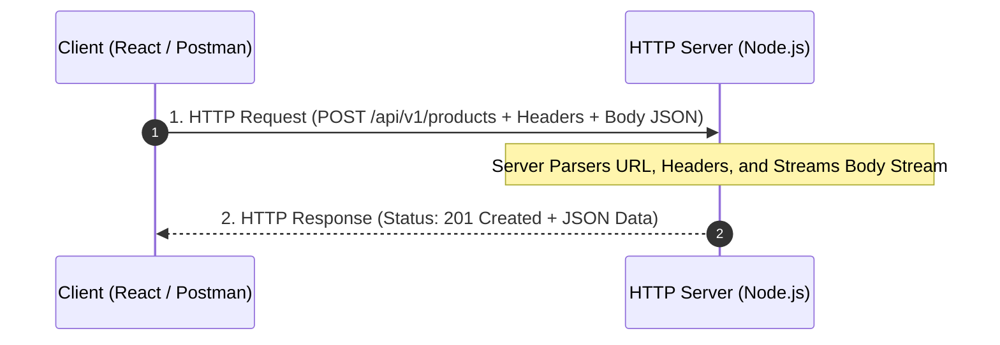

## 🌐 ពិធីការ HTTP ក្នុងប្រព័ន្ធ Web & APIs

**HTTP (Hypertext Transfer Protocol)** គឺជាពិធីការគ្រឹះនៃការទំនាក់ទំនងលើពិភពអ៊ីនធឺណិត។ រាល់ការទាញទិន្នន័យ (Fetch) ពី Frontend (React, Mobile App) ទៅកាន់ Backend Server គឺដើរតាម **Request-Response Cycle**៖



---

## 📊 កាយវិភាគនៃ HTTP Request & Response

### 1. HTTP Request Components
- **Method (កិរិយាសព្ទ):** 
  - `GET`: ទាញយកទិន្នន័យ (Read-only, គ្មាន Body)
  - `POST`: បង្កើតទិន្នន័យថ្មី (Create, មាន Body)
  - `PUT`: ជំនួសទិន្នន័យចាស់ទាំងស្រុង (Full Replace)
  - `PATCH`: កែប្រែទិន្នន័យតែមួយផ្នែក (Partial Update)
  - `DELETE`: លុបទិន្នន័យ (Delete)
- **Headers:** មេតាព័ត៌មាន (Metadata) ដូចជា `Content-Type: application/json`, `Authorization: Bearer <token>`
- **URL & Params:** Path (`/api/products`), Route params (`/api/products/42`), Query params (`?page=1&limit=10`)
- **Body / Payload:** ទិន្នន័យទម្រង់ JSON, Form-data, ឬ Binary stream

### 2. HTTP Status Codes Classification
- **`2xx Success`:** `200 OK`, `201 Created`, `204 No Content`
- **`3xx Redirection`:** `301 Moved Permanently`, `304 Not Modified` (Caching)
- **`4xx Client Errors`:** `400 Bad Request`, `401 Unauthorized`, `403 Forbidden`, `404 Not Found`, `422 Unprocessable Entity`
- **`5xx Server Errors`:** `500 Internal Server Error`, `502 Bad Gateway`, `503 Service Unavailable`

---

## 🛠️ ការបង្កើត Core HTTP Server ជាមួយ Node.js

Node.js ផ្តល់នូវ Module `node:http` ស្រាប់សម្រាប់បង្កើត Server ដោយមិនចាំបាច់មាន Library ក្រៅ៖

```javascript
import http from 'node:http';

const server = http.createServer((req, res) => {
  const { url, method } = req;
  console.log(`[${new Date().toISOString()}] ${method} ${url}`);

  // កំណត់ Response Headers
  res.setHeader('Content-Type', 'application/json');

  if (url === '/api/health' && method === 'GET') {
    res.writeHead(200);
    res.end(JSON.stringify({ status: 'ok', uptime: process.uptime() }));
  } else if (url === '/api/users' && method === 'GET') {
    res.writeHead(200);
    res.end(JSON.stringify([
      { id: 1, name: 'Sok Dara', role: 'admin' },
      { id: 2, name: 'Chan Bopha', role: 'developer' }
    ]));
  } else {
    res.writeHead(404);
    res.end(JSON.stringify({ error: 'Endpoint Not Found' }));
  }
});

const PORT = 3000;
server.listen(PORT, () => {
  console.log(`🚀 Node.js Core Server running at http://localhost:${PORT}`);
});
```

> [!NOTE]
> ការសរសេរ Server ដោយប្រើតែ `http` core module ផ្ទាល់ តម្រូវឱ្យយើង manually parse request body streams, routing, query strings, និង headers។ ហេតុនេះហើយបានជាគេនិយមប្រើ **Express.js** ឬ **Fastify** សម្រាប់ Build REST APIs ដែលមាន Routing និង Middleware ស្រាប់!
