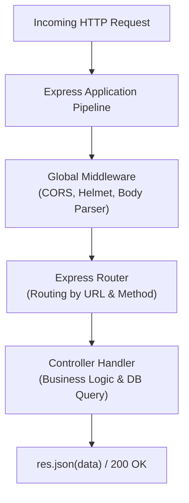

## 🚂 អ្វីទៅជា Express.js?

**Express.js** គឺជា Web Framework ដ៏ល្បីល្បាញ និងពេញនិយមបំផុតសម្រាប់ Node.js។ វាត្រូវបានបង្កើតឡើងលើ Core `http` module ដោយផ្តល់នូវ Abstraction ដ៏ងាយស្រួល ក្នុងការបង្កើត **RESTful APIs, Single-Page Applications Backend, និង Microservices**។



---

## 🛠️ ការដំឡើង និងបង្កើត Express Application

### ជំហានទី ១: បង្កើតគម្រោង និងដំឡើង Packages
```bash
mkdir express-api && cd express-api
npm init -y
npm install express dotenv
npm install -D nodemon @types/express @types/node
```

### ជំហានទី ២: កំណត់ `package.json`
```json
{
  "name": "express-api",
  "version": "1.0.0",
  "type": "module",
  "scripts": {
    "dev": "nodemon src/app.js",
    "start": "node src/app.js"
  },
  "dependencies": {
    "dotenv": "^16.4.5",
    "express": "^4.19.2"
  },
  "devDependencies": {
    "nodemon": "^3.1.0"
  }
}
```

### ជំហានទី ៣: សរសេរកូដ Server (`src/app.js`)
```javascript
import express from 'express';
import 'dotenv/config';

const app = express();
const PORT = process.env.PORT || 5000;

// Built-in Middleware សម្រាប់បកប្រែ JSON Body
app.use(express.json());

// Basic Routes
app.get('/', (req, res) => {
  res.json({
    name: "Express.js REST API",
    status: "active",
    timestamp: new Date().toISOString()
  });
});

app.get('/api/v1/health', (req, res) => {
  res.status(200).json({
    uptime: process.uptime(),
    message: "Server is healthy! 🚀"
  });
});

app.listen(PORT, () => {
  console.log(`⚡ Server running on http://localhost:${PORT}`);
});
```

---

## 🔍 ការយល់ដឹងពី `req` និង `res` Objects

| Object | មុខងារចម្បង | ឧទាហរណ៍ Properties & Methods |
|---|---|---|
| **`req` (Request)** | ផ្ទុកព័ត៌មានដែលផ្ញើមកពី Client | `req.body`, `req.params`, `req.query`, `req.headers`, `req.ip` |
| **`res` (Response)** | គ្រប់គ្រងការឆ្លើយតបទៅ Client វិញ | `res.status(200)`, `res.json({...})`, `res.send()`, `res.redirect()` |

> [!TIP]
> ត្រូវចាំថា នៅក្នុង Express រាល់ Route Handler ត្រូវតែបញ្ចប់ដោយការហៅ method នៃ response ដូចជា `res.json(...)` ឬ `res.send(...)` ឬហៅ `next()` បើពុំនោះទេ Client នឹងជាប់រង់ចាំ (Hanging / Timeout)។
