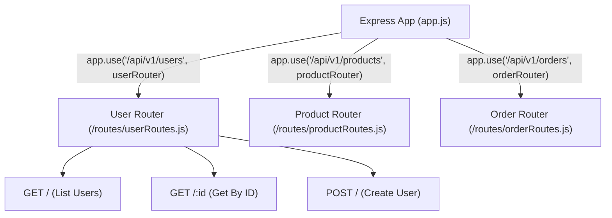

## 🗺️ អ្វីទៅជា Routing ក្នុង Express?

**Routing** គឺជាការកំណត់របៀបដែល Application ឆ្លើយតបទៅកាន់ Client Request ផ្អែកលើ **Endpoint (URI Path)** និង **HTTP Method (GET, POST, PUT, DELETE)**។

នៅក្នុង Production Apps យើងមិនសរសេរ Routes ទាំងអស់ក្នុង `app.js` ទេ យើងបំបែកវាជា Modules ដោយប្រើ **`express.Router()`**៖



---

## 🛠️ ការបង្កើត Modular Router ជាក់ស្តែង

### 1. បង្កើត User Routes (`src/routes/user.routes.js`)
```javascript
import { Router } from 'express';

const router = Router();

// GET /api/v1/users (ជាមួយ Query parameters)
router.get('/', (req, res) => {
  const { page = 1, limit = 10, search = '' } = req.query;
  res.json({
    page: Number(page),
    limit: Number(limit),
    filter: search,
    data: []
  });
});

// GET /api/v1/users/:id (ជាមួយ Route parameters)
router.get('/:id', (req, res) => {
  const { id } = req.params;
  res.json({ id, name: `User ${id}`, email: `user${id}@example.com` });
});

// POST /api/v1/users
router.post('/', (req, res) => {
  const { name, email } = req.body;
  res.status(201).json({
    message: "User created successfully!",
    user: { id: Date.now(), name, email }
  });
});

// DELETE /api/v1/users/:id
router.delete('/:id', (req, res) => {
  const { id } = req.params;
  res.status(200).json({ message: `User with ID ${id} deleted.` });
});

export default router;
```

### 2. ចុះឈ្មោះ Router ក្នុង Main App (`src/app.js`)
```javascript
import express from 'express';
import userRoutes from './routes/user.routes.js';

const app = express();
app.use(express.json());

// Mount User Routes ក្រោម Prefix /api/v1/users
app.use('/api/v1/users', userRoutes);

export default app;
```

---

## 💡 Route Parameters vs Query Strings

| ប្រភេទ | ទម្រង់ URL | កូដ Route Pattern | របៀបចាប់ទិន្នន័យ | ករណីប្រើប្រាស់ |
|---|---|---|---|---|
| **Route Params** | `/products/105` | `/products/:id` | `req.params.id` | សម្គាល់ Resource ជាក់លាក់មួយ |
| **Nested Params** | `/posts/3/comments/12` | `/posts/:postId/comments/:commentId` | `req.params.postId` | ទំនាក់ទំនងឪពុក-កូន (Hierarchical data) |
| **Query Strings** | `/products?category=shoes&sort=asc` | `/products` | `req.query.category` | ការ Filter, Sorting, Pagination, Search |
