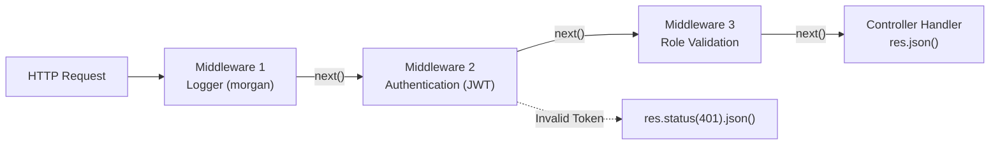

## 🧱 អ្វីទៅជា Middleware?

**Middleware** គឺជា Function ដែលមានសិទ្ធិចូលទៅកាន់ **Request Object (`req`)**, **Response Object (`res`)**, និង Function **`next`** នៅក្នុង Request-Response cycle របស់ Express។

អ្នកអាចស្រមៃថា Middleware ដូចជា **ប៉ុស្តិ៍ត្រួតពិនិត្យ (Checkpoint/Interceptor)** នៅតាមផ្លូវ៖



---

## 🔍 ប្រភេទនៃ Middleware ក្នុង Express

1. **Application-level Middleware:** ដំណើរការលើរាល់ Request ទាំងអស់ (`app.use(...)`)
2. **Router-level Middleware:** ដំណើរការសម្រាប់តែ Router ជាក់លាក់ (`router.use(...)`)
3. **Route-specific Middleware:** ដំណើរការសម្រាប់តែ Route ណាមួយ (`router.get('/profile', authMiddleware, getProfile)`)
4. **Error-handling Middleware:** ទទួល Parameters ចំនួន ៤ `(err, req, res, next)`
5. **Built-in Middleware:** មកស្រាប់ជាមួយ Express (`express.json()`, `express.static()`)
6. **Third-party Middleware:** ដំឡើងពី NPM (`cors`, `morgan`, `helmet`)

---

## 💻 ការបង្កើត Custom Middlewares ជាក់ស្តែង

### 1. Request Logger Middleware (`src/middlewares/logger.js`)
```javascript
export const requestLogger = (req, res, next) => {
  const start = Date.now();
  const { method, url, ip } = req;
  
  res.on('finish', () => {
    const duration = Date.now() - start;
    console.log(`[${method}] ${url} - Status: ${res.statusCode} (${duration}ms) - IP: ${ip}`);
  });
  
  next(); // ត្រូវតែហៅ next() ដើម្បីទៅ Middleware បន្ទាប់
};
```

### 2. Authentication Guard Middleware (`src/middlewares/auth.js`)
```javascript
export const requireAuth = (req, res, next) => {
  const authHeader = req.headers.authorization;

  if (!authHeader || !authHeader.startsWith('Bearer ')) {
    return res.status(401).json({
      success: false,
      error: "Unauthorized: Token ត្រូវបានទាមទារ"
    });
  }

  const token = authHeader.split(' ')[1];

  // ឧទាហរណ៍ពិនិត្យ token
  if (token !== "secret-token-xyz") {
    return res.status(403).json({
      success: false,
      error: "Forbidden: Token មិនត្រឹមត្រូវ ឬផុតកំណត់"
    });
  }

  // ភ្ជាប់ព័ត៌មាន user ចូល req សម្រាប់ routes បន្ទាប់ប្រើ
  req.user = { id: 101, username: "admin", role: "superadmin" };
  next();
};
```

---

## 🔌 ការប្រើប្រាស់ Third-Party Middlewares សំខាន់ៗ

```bash
npm install morgan cors helmet cookie-parser
```

```javascript
import express from 'express';
import morgan from 'morgan';
import cors from 'cors';
import helmet from 'helmet';
import cookieParser from 'cookie-parser';

const app = express();

// Security Headers
app.use(helmet());

// Cross-Origin Resource Sharing
app.use(cors({ origin: 'http://localhost:3000', credentials: true }));

// HTTP Request Logger
app.use(morgan('dev'));

// Parsing Payloads & Cookies
app.use(express.json({ limit: '10mb' }));
app.use(express.urlencoded({ extended: true }));
app.use(cookieParser());
```
