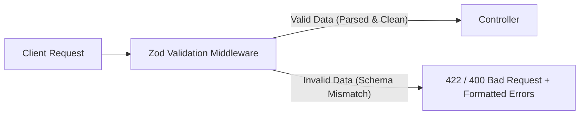

## 🛡️ ហេតុអ្វីត្រូវមាន Request Validation?

ប្រសិនបើគ្មាន Validation ទេ កម្មវិធី Server របស់អ្នកអាចជួបប្រទះបញ្ហាជាច្រើនដូចជា៖
- Runtime Crashes ដោយសារតែ Types មិនត្រូវ (`undefined is not a function`)
- ទិន្នន័យមិនពេញលេញ ឬខូចរចនាសម្ព័ន្ធធ្លាក់ចូល Database
- ហានិភ័យ Security Attacks (Injection, Data Tampering)



---

## 📦 ការដំឡើង និងប្រើប្រាស់ Zod

```bash
npm install zod
```

### 1. បង្កើត Generic Validate Middleware (`src/middlewares/validate.js`)
```javascript
import { ZodError } from 'zod';

export const validate = (schema) => async (req, res, next) => {
  try {
    // Validate ទាំង body, query, និង params
    const parsed = await schema.parseAsync({
      body: req.body,
      query: req.query,
      params: req.params,
    });

    // ជំនួសទិន្នន័យចាស់ដោយ sanitized data
    req.body = parsed.body || req.body;
    req.query = parsed.query || req.query;
    req.params = parsed.params || req.params;

    next();
  } catch (error) {
    if (error instanceof ZodError) {
      const formattedErrors = error.errors.map((err) => ({
        field: err.path.join('.'),
        message: err.message,
      }));

      return res.status(422).json({
        success: false,
        message: "ទិន្នន័យផ្ញើមកមិនត្រឹមត្រូវតាមទម្រង់ឡើយ (Validation Failed)",
        errors: formattedErrors,
      });
    }

    next(error);
  }
};
```

---

## 📝 ការកំណត់ Zod Schemas និងការប្រើប្រាស់ក្នុង Routes

```javascript
import express from 'express';
import { z } from 'zod';
import { validate } from './middlewares/validate.js';

const app = express();
app.use(express.json());

// 1. កំណត់ Schema
const createProductSchema = z.object({
  body: z.object({
    name: z.string({ required_error: "ឈ្មោះទំនិញគឺចាំបាច់" })
           .min(3, "ឈ្មោះត្រូវមានយ៉ាងតិច 3 តួអក្សរ")
           .max(100, "ឈ្មោះមិនអាចលើសពី 100 តួអក្សរ"),
    price: z.number({ required_error: "តម្លៃទំនិញគឺចាំបាច់" })
            .positive("តម្លៃត្រូវតែជាចំនួនវិជ្ជមាន (> 0)"),
    category: z.enum(['electronics', 'clothing', 'books', 'food'], {
      errorMap: () => ({ message: "ប្រភេទមិនត្រឹមត្រូវឡើយ" })
    }),
    email: z.string().email("ទម្រង់ Email មិនត្រឹមត្រូវ").optional(),
  })
});

// 2. ប្រើប្រាស់ក្នុង Route
app.post('/api/v1/products', validate(createProductSchema), (req, res) => {
  res.status(201).json({
    success: true,
    message: "បង្កើតទំនិញជោគជ័យ!",
    data: req.body
  });
});
```

> [!TIP]
> ប្រើប្រាស់ **Zod** ផ្តល់នូវអត្ថប្រយោជន៍ ២ ក្នុងពេលតែមួយ៖ **Runtime Validation** សម្រាប់ Express និង **Static Type Inference (`z.infer<typeof schema>`)** សម្រាប់ TypeScript!
