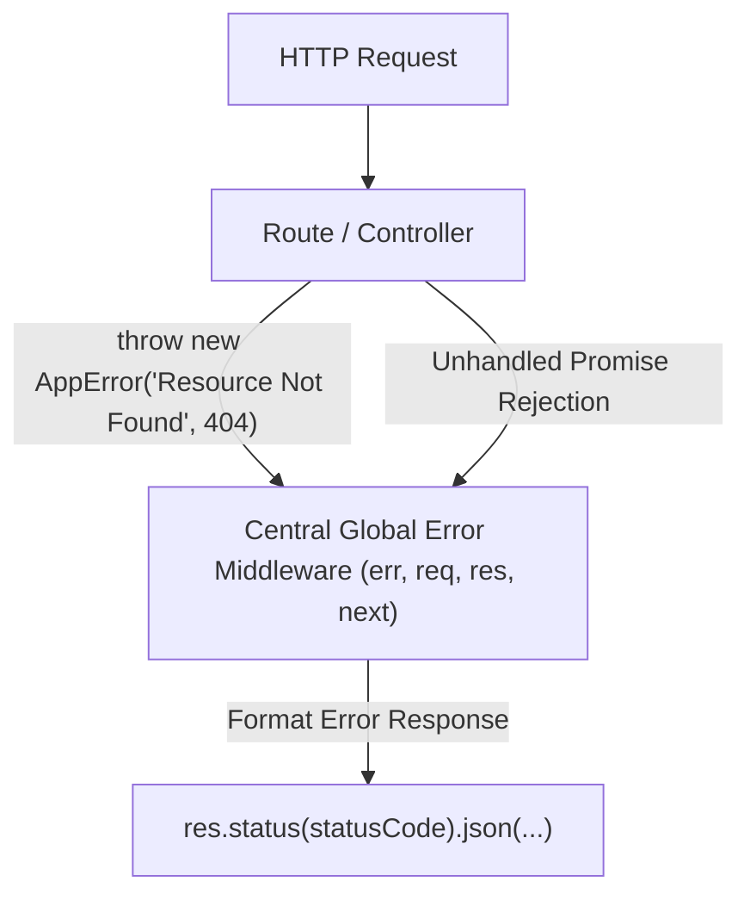

## 💥 បញ្ហានៃការ Handle Error គ្មានស្តង់ដារ

ប្រសិនបើគ្មានប្រព័ន្ធ Error Handling កណ្តាលទេ អ្នកនឹងត្រូវសរសេរ `try/catch` នៅគ្រប់ Controller ហើយប្រសិនបើមាន Unhandled Rejection ណាមួយកើតឡើង កម្មវិធី Node.js ទាំងមូលអាចនឹងត្រូវ **Crash**។



---

## 🏗️ ការបង្កើត Custom AppError Class

```javascript
// src/errors/AppError.js
export class AppError extends Error {
  constructor(message, statusCode = 500) {
    super(message);
    this.statusCode = statusCode;
    this.status = `${statusCode}`.startsWith('4') ? 'fail' : 'error';
    this.isOperational = true; // Error ដែលយើងស្គាល់ (Operational error)

    Error.captureStackTrace(this, this.constructor);
  }
}

export class NotFoundError extends AppError {
  constructor(resource = 'Resource') {
    super(`${resource} រកមិនឃើញឡើយ (404 Not Found)`, 404);
  }
}

export class UnauthorizedError extends AppError {
  constructor(message = 'មិនមានសិទ្ធិចូលដំណើរការ (Unauthorized)') {
    super(message, 401);
  }
}
```

---

## 🛡️ Wrapper សម្រាប់ Async Handlers (`asyncHandler`)

ចាប់តាំងពី Express 4 មិនទាន់ Catch Async Errors ដោយស្វ័យប្រវត្តិ យើងបង្កើត Utility `asyncHandler`៖

```javascript
// src/utils/asyncHandler.js
export const asyncHandler = (fn) => (req, res, next) => {
  Promise.resolve(fn(req, res, next)).catch(next);
};
```

---

## ⚙️ ការរៀបចំ Global Error Middleware

```javascript
// src/middlewares/errorHandler.js
export const errorHandler = (err, req, res, next) => {
  err.statusCode = err.statusCode || 500;
  err.status = err.status || 'error';

  const isDev = process.env.NODE_ENV === 'development';

  if (isDev) {
    // ពេល Development៖ បង្ហាញ Stack Trace ពេញលេញដើម្បីងាយស្រួល Debug
    return res.status(err.statusCode).json({
      success: false,
      status: err.status,
      message: err.message,
      stack: err.stack,
      error: err,
    });
  }

  // ពេល Production៖ បង្ហាញតែសារដែលមានសុវត្ថិភាព មិនឱ្យបែកធ្លាយ Internal Code
  if (err.isOperational) {
    return res.status(err.statusCode).json({
      success: false,
      message: err.message,
    });
  }

  // កំហុសដែលមិនស្គាល់ (Bug / 500 Server Error)
  console.error("💥 UNEXPECTED ERROR:", err);
  return res.status(500).json({
    success: false,
    message: "មានបញ្ហាបច្ចេកទេសខាងម៉ាស៊ីនមេ សូមព្យាយាមម្តងទៀតនៅពេលក្រោយ!",
  });
};
```

### ការចុះឈ្មោះក្នុង `app.js`:
```javascript
import express from 'express';
import { NotFoundError } from './errors/AppError.js';
import { errorHandler } from './middlewares/errorHandler.js';

const app = express();
app.use(express.json());

// Routes...

// 404 Catch-all handler សម្រាប់ routes ដែលគ្មាន
app.all('*', (req, res, next) => {
  next(new NotFoundError(`មិនមាន Endpoint ${req.originalUrl} នៅលើ Server ឡើយ`));
});

// Global Error Handler ត្រូវតែនៅខាងក្រោមគេបង្អស់ជានិច្ច!
app.use(errorHandler);
```
