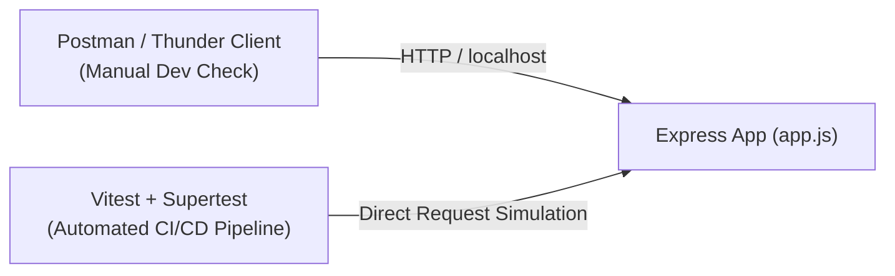

## 🧪 វិធីសាស្ត្រតេស្ត API ទាំង ២ ប្រភេទ

ក្នុងការអភិវឌ្ឍន៍ Backend យើងមានវិធីសាស្ត្រតេស្ត ២ សំខាន់៖
1. **Manual Testing (ការតេស្តដោយផ្ទាល់ដៃ):** ប្រើ GUI Tools ដូចជា Postman, Thunder Client, Insomnia ឬ Bruno។
2. **Automated Integration Testing (ការតេស្តស្វ័យប្រវត្តិ):** សរសេរ Script ដោយប្រើ Test Runner (Vitest / Jest) ជាមួយ **Supertest**។



---

## ⚡ 1. Manual Testing ជាមួយ Thunder Client (VS Code Extension)

Thunder Client គឺជា Extension ស្រាលនៅក្នុង VS Code ដែលអនុញ្ញាតឱ្យអ្នកតេស្ត API ដោយមិនបាច់ចេញពី Editor៖

1. ដំឡើង Extension **Thunder Client** ពី VS Code Marketplace
2. ចុច New Request -> ជ្រើសរើស Method `POST` -> ដាក់ URL `http://localhost:3000/api/v1/products`
3. ក្នុងផ្ទាំង **Headers:** បន្ថែម `Content-Type: application/json`
4. ក្នុងផ្ទាំង **Body:** បញ្ចូល JSON Payload៖
   ```json
   {
     "name": "Sony WH-1000XM5",
     "price": 349.99,
     "category": "electronics"
   }
   ```
5. ចុច **Send** រួចពិនិត្យមើល Status Code (`201 Created`) និង Response Data។

---

## 🤖 2. Automated Testing ជាមួយ Supertest & Vitest

### ជំហានទី ១: ដំឡើង Testing Libraries
```bash
npm install -D vitest supertest @types/supertest
```

### ជំហានទី ២: បំបែក `app.js` និង `server.js`
> [!IMPORTANT]
> **Best Practice:** កុំហៅ `app.listen()` នៅក្នុង `app.js`។ ទុក `app.js` សម្រាប់តែ Export `app` instance ហើយបង្កើត `server.js` ដាច់ដោយឡែកសម្រាប់ `app.listen()`។ វិធីនេះ Supertest អាច Import `app` ទៅតេស្តបានយ៉ាងរលូន។

### ជំហានទី ៣: សរសេរ Test Suite (`tests/product.test.js`)
```javascript
import { describe, it, expect } from 'vitest';
import request from 'supertest';
import app from '../src/app.js';

describe('GET /api/v1/products', () => {
  it('គួរតែឆ្លើយតបមកវិញនូវ Status 200 និង Array នៃ Products', async () => {
    const res = await request(app)
      .get('/api/v1/products')
      .expect('Content-Type', /json/)
      .expect(200);

    expect(res.body.success).toBe(true);
    expect(Array.isArray(res.body.data)).toBe(true);
  });
});

describe('POST /api/v1/products', () => {
  it('គួរតែបង្កើត Product ថ្មីបានជោគជ័យ (201 Created)', async () => {
    const newProduct = {
      name: "Logitech MX Master 3S",
      price: 99.99,
      category: "electronics"
    };

    const res = await request(app)
      .post('/api/v1/products')
      .send(newProduct)
      .expect(201);

    expect(res.body.success).toBe(true);
    expect(res.body.data.name).toBe(newProduct.name);
  });

  it('គួរតែបដិសេធ (422/400) ប្រសិនបើខ្វះ name ឬ price', async () => {
    const invalidPayload = { price: 50 }; // ខ្វះ field name

    const res = await request(app)
      .post('/api/v1/products')
      .send(invalidPayload)
      .expect(422);

    expect(res.body.success).toBe(false);
  });
});
```

### ជំហានទី ៤: ដំណើរការ Tests
```bash
npx vitest run
```
