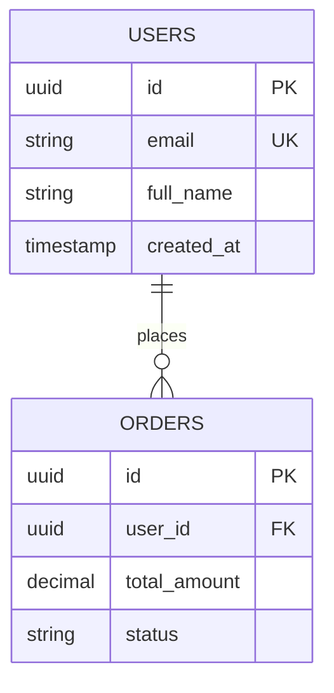

## 🗄️ អ្វីទៅជា Relational Database (RDBMS)?

**RDBMS (Relational Database Management System)** រៀបចំផ្ទុកទិន្នន័យជាទម្រង់ **Tables (តារាង)** ដែលមាន **Columns (ជួរឈរ/Attributes)** និង **Rows (ជួរដេក/Records)** ព្រមទាំងមានទំនាក់ទំនង (Relationships) រវាងតារាងនីមួយៗ។



---

## 📜 ភាសា SQL: DDL vs DML

### 1. DDL (Data Definition Language) - កំណត់រចនាសម្ព័ន្ធ Table
```sql
-- បង្កើត Table
CREATE TABLE users (
    id UUID PRIMARY KEY DEFAULT gen_random_uuid(),
    username VARCHAR(50) UNIQUE NOT NULL,
    email VARCHAR(255) UNIQUE NOT NULL,
    age INT CHECK (age >= 18),
    is_active BOOLEAN DEFAULT TRUE,
    created_at TIMESTAMPTZ DEFAULT CURRENT_TIMESTAMP
);
```

### 2. DML (Data Manipulation Language) - គ្រប់គ្រងទិន្នន័យ

```sql
-- 1. INSERT (បង្កើត Record ថ្មី)
INSERT INTO users (username, email, age) 
VALUES ('sok_dara', 'sok@example.com', 24)
RETURNING id, username, created_at;

-- 2. SELECT (ទាញយកទិន្នន័យជាមួយលក្ខខណ្ឌ)
SELECT id, username, email 
FROM users 
WHERE is_active = TRUE AND age > 20
ORDER BY created_at DESC 
LIMIT 10 OFFSET 0;

-- 3. UPDATE (កែប្រែទិន្នន័យ)
UPDATE users 
SET age = 25, is_active = TRUE 
WHERE username = 'sok_dara'
RETURNING *;

-- 4. DELETE (លុបទិន្នន័យ)
DELETE FROM users 
WHERE id = 'a0eebc99-9c0b-4ef8-bb6d-6bb9bd380a11';
```

---

## 🎯 Data Types សំខាន់ៗក្នុង PostgreSQL

| Data Type | ការពិពណ៌នា | ឧទាហរណ៍ |
|---|---|---|
| `UUID` | Universally Unique Identifier (128-bit) | `a0eebc99-9c0b-4ef8-bb6d-6bb9bd380a11` |
| `VARCHAR(n)` | ខ្សែអក្សរមានកំណត់ប្រវែងអតិបរមា | `VARCHAR(255)` សម្រាប់ Emails, Titles |
| `TEXT` | អត្ថបទវែងគ្មានកំណត់ប្រវែង | សម្រាប់ Blog Contents, Descriptions |
| `NUMERIC(p, s)` | លេខទសភាគសុក្រឹត (គ្មានបញ្ហា Floating-point) | `NUMERIC(10, 2)` សម្រាប់តម្លៃលុយ |
| `TIMESTAMPTZ` | កាលបរិច្ឆេទ និងពេលវេលាគិតបញ្ចូល Timezone | `2026-08-25 08:50:00+07` |
| `JSONB` | Binary JSON អាច Index និង Query Key-Value បាន | `{"tags": ["tech", "node"], "verified": true}` |
