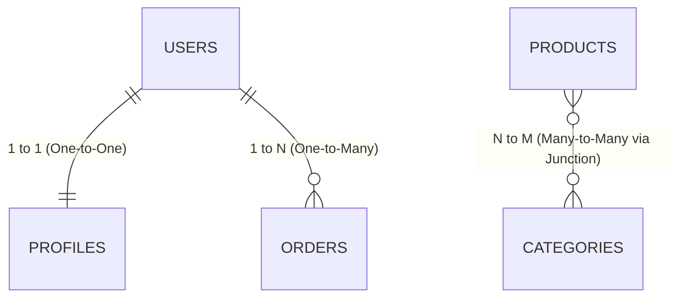
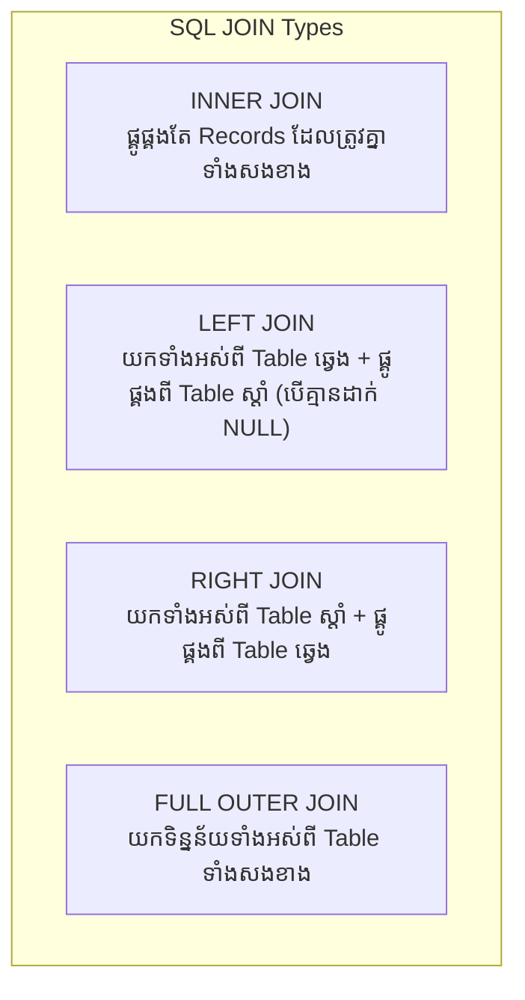

## 🔗 ៣ ប្រភេទនៃ Database Relationships



### 1. One-to-One (1:1)
User ម្នាក់មាន Profile តែមួយគត់៖
```sql
CREATE TABLE user_profiles (
    id UUID PRIMARY KEY DEFAULT gen_random_uuid(),
    user_id UUID UNIQUE NOT NULL REFERENCES users(id) ON DELETE CASCADE,
    avatar_url TEXT,
    bio TEXT
);
```

### 2. One-to-Many (1:N)
User ម្នាក់អាចបញ្ជាទិញ Orders បានច្រើន៖
```sql
CREATE TABLE orders (
    id UUID PRIMARY KEY DEFAULT gen_random_uuid(),
    user_id UUID NOT NULL REFERENCES users(id) ON DELETE CASCADE,
    total_amount NUMERIC(10, 2) NOT NULL,
    created_at TIMESTAMPTZ DEFAULT CURRENT_TIMESTAMP
);
```

### 3. Many-to-Many (N:M)
Product មួយអាចនៅក្នុង Categories ច្រើន ហើយ Category មួយអាចផ្ទុក Products ច្រើន។ យើងត្រូវការ **Junction / Pivot Table**៖
```sql
CREATE TABLE product_categories (
    product_id UUID REFERENCES products(id) ON DELETE CASCADE,
    category_id UUID REFERENCES categories(id) ON DELETE CASCADE,
    PRIMARY KEY (product_id, category_id)
);
```

---

## 🤝 ប្រភេទនៃ SQL JOINs



### ឧទាហរណ៍ជាក់ស្តែង៖

```sql
-- 1. INNER JOIN: ទាញយកបញ្ជី User ដែលមាន Order
SELECT u.username, o.id AS order_id, o.total_amount
FROM users u
INNER JOIN orders o ON u.id = o.user_id;

-- 2. LEFT JOIN: ទាញយក User ទាំងអស់ (ទោះមិនធ្លាប់ Order ក៏បង្ហាញឈ្មោះ)
SELECT u.username, COUNT(o.id) AS total_orders, COALESCE(SUM(o.total_amount), 0) AS total_spent
FROM users u
LEFT JOIN orders o ON u.id = o.user_id
GROUP BY u.id, u.username
ORDER BY total_spent DESC;
```
