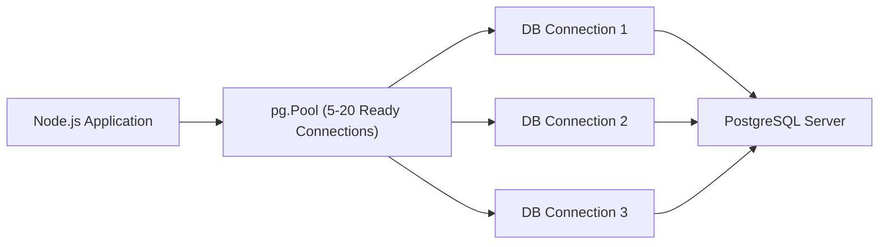

## 🔌 ការភ្ជាប់ Node.js ជាមួយ PostgreSQL តាមរយៈ `pg`

មុនពេលប្រើ ORM ការយល់ដឹងពី Low-Level Database Driver ដូចជា `pg` ជួយឱ្យយើងយល់ពី Query Performance, Connection Lifecycle, និង Security។



---

## ⚙️ ការរៀបចំ Database Pool (`src/config/db.js`)

```javascript
import pg from 'pg';
import 'dotenv/config';

const { Pool } = pg;

export const db = new Pool({
  connectionString: process.env.DATABASE_URL,
  max: 20, // ចំនួន Connection អតិបរមាក្នុង Pool
  idleTimeoutMillis: 30000, // បិទ connection ដែលទំនេរលើស 30s
  connectionTimeoutMillis: 2000, // Timeout បើមិនអាចភ្ជាប់ក្នុង 2s
});

// សាកល្បងភ្ជាប់ Database ពេល Startup
db.on('connect', () => {
  console.log('✅ PostgreSQL Pool connection established');
});

db.on('error', (err) => {
  console.error('❌ Unexpected error on idle PostgreSQL client', err);
  process.exit(-1);
});
```

---

## 🛡️ ការអនុវត្ត CRUD Controller ជាមួយ Parameterized Queries

```javascript
// src/controllers/user.controller.js
import { db } from '../config/db.js';

// 1. GET ALL USERS
export const getUsers = async (req, res, next) => {
  try {
    const { search = '', limit = 10, offset = 0 } = req.query;
    
    // Parameterized Query ការពារ SQL Injection
    const queryText = `
      SELECT id, username, email, is_active, created_at 
      FROM users 
      WHERE username ILIKE $1 
      ORDER BY created_at DESC 
      LIMIT $2 OFFSET $3
    `;
    const values = [`%${search}%`, Number(limit), Number(offset)];
    
    const result = await db.query(queryText, values);
    res.status(200).json({ success: true, data: result.rows });
  } catch (error) {
    next(error);
  }
};

// 2. CREATE USER
export const createUser = async (req, res, next) => {
  try {
    const { username, email } = req.body;
    
    const queryText = `
      INSERT INTO users (username, email) 
      VALUES ($1, $2) 
      RETURNING id, username, email, created_at
    `;
    const result = await db.query(queryText, [username, email]);
    
    res.status(201).json({ success: true, data: result.rows[0] });
  } catch (error) {
    next(error);
  }
};
```

> [!CAUTION]
> **ដាច់ខាតកុំធ្វើបែបនេះ (SQL Injection Vulnerability):**
> ```javascript
> // ❌ គ្រោះថ្នាក់បំផុត! Hacker អាចបញ្ចូល `' OR '1'='1`
> const query = `SELECT * FROM users WHERE email = '${req.body.email}'`;
> await db.query(query);
> ```
