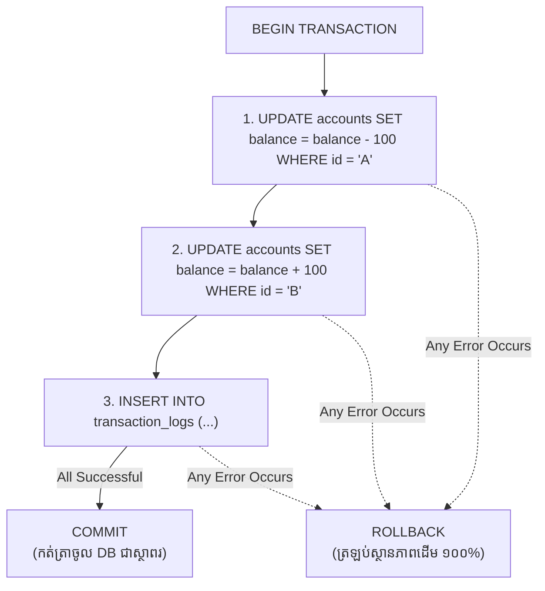

## 🏦 ហេតុអ្វីយើងត្រូវការ Transactions?

សូមស្រមៃមើលសេណារីយ៉ូនៃការផ្ទេរប្រាក់ពី **Account A** ទៅ **Account B**៖
1. ដកប្រាក់ $100 ពី Account A
2. បន្ថែមប្រាក់ $100 ទៅ Account B

ប្រសិនបើ Server ស្រាប់តែដាច់ភ្លើង ឬ Error កើតឡើងនៅចន្លោះជំហានទី ១ និងទី ២ នោះលុយ $100 នឹងបាត់បង់ដោយគ្មានដាន!

ដំណោះស្រាយគឺ **Database Transaction**៖



---

## 💻 ការអនុវត្ត Transaction ជាមួយ `pg.Pool`

> [!IMPORTANT]
> សម្រាប់ Transaction អ្នកត្រូវតែទាញយក Dedicated Client ម្នាក់ចេញពី Pool (`await pool.connect()`) ព្រោះ Commands ដូចជា `BEGIN`, `COMMIT`, `ROLLBACK` ត្រូវតែដំណើរការលើ Database Session តែមួយ។

```javascript
import { db } from '../config/db.js';

export async function transferMoney(fromAccountId, toAccountId, amount) {
  // 1. ខ្ចី Client មួយពី Pool
  const client = await db.connect();

  try {
    // 2. ចាប់ផ្តើម Transaction
    await client.query('BEGIN');

    // 3. ដកប្រាក់ពីអ្នកផ្ញើ
    const deductQuery = `
      UPDATE accounts 
      SET balance = balance - $1 
      WHERE id = $2 AND balance >= $1
      RETURNING balance;
    `;
    const deductRes = await client.query(deductQuery, [amount, fromAccountId]);

    if (deductRes.rowCount === 0) {
      throw new Error("សមតុល្យទឹកប្រាក់មិនគ្រប់គ្រាន់ ឬគណនីរកមិនឃើញឡើយ");
    }

    // 4. បន្ថែមប្រាក់ទៅអ្នកទទួល
    const addQuery = `
      UPDATE accounts 
      SET balance = balance + $1 
      WHERE id = $2;
    `;
    await client.query(addQuery, [amount, toAccountId]);

    // 5. កត់ត្រាក្នុង Log
    await client.query(
      'INSERT INTO transfers (from_id, to_id, amount) VALUES ($1, $2, $3)',
      [fromAccountId, toAccountId, amount]
    );

    // 6. បញ្ជាក់ជោគជ័យ
    await client.query('COMMIT');
    return { success: true, message: "ការផ្ទេរប្រាក់ទទួលបានជោគជ័យ!" };

  } catch (error) {
    // 7. ប្រសិនបើមានបញ្ហា ត្រឡប់ក្រោយទាំងអស់
    await client.query('ROLLBACK');
    console.error("Transaction Rollbacked:", error.message);
    throw error;

  } finally {
    // 8. ដាច់ខាតត្រូវ Release Client ត្រឡប់ទៅ Pool វិញជានិច្ច!
    client.release();
  }
}
```
