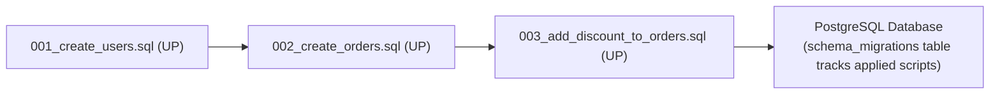

## 🗂️ ហេតុអ្វីត្រូវប្រើ Database Migrations?

ប្រសិនបើអ្នកធ្វើការជាមួយក្រុម Developer ច្រើននាក់ ហើយម្នាក់ៗបន្ថែម Column ដោយផ្ទាល់ដៃក្នុង Table នោះ Database ក្នុងម៉ាស៊ីននីមួយៗនឹងខុសគ្នា (Schema Drift)។

**Database Migrations** ដើរតួជា **Git សម្រាប់ Database Schema**៖
- កត់ត្រារាល់ការកែប្រែ Table ក្នុង File មាន Timestamp (ឧ. `1700000000000_create_users_table.sql`)
- អាច Replicate Schema ដូចគ្នា ១០០% លើម៉ាស៊ីន Dev, Staging, និង Production
- អាច Upgrade (`UP`) និង Downgrade (`DOWN/ROLLBACK`) បានគ្រប់ពេលវេលា



---

## 🛠️ ការប្រើប្រាស់ `node-pg-migrate`

### 1. ដំឡើង Tool
```bash
npm install -D node-pg-migrate
```

### 2. បង្កើត Migration Script ដំបូង
```bash
npx node-pg-migrate create create-users-table
```
វានឹងបង្កើតឯកសារមួយក្នុងថត `migrations/`៖

```javascript
// migrations/1710000000000_create-users-table.js
export const up = (pgm) => {
  pgm.createTable('users', {
    id: { type: 'uuid', primaryKey: true, default: pgm.func('gen_random_uuid()') },
    email: { type: 'varchar(255)', notNull: true, unique: true },
    password_hash: { type: 'text', notNull: true },
    role: { type: 'varchar(20)', notNull: true, default: 'customer' },
    created_at: {
      type: 'timestamptz',
      notNull: true,
      default: pgm.func('current_timestamp'),
    },
  });

  pgm.createIndex('users', 'email');
};

export const down = (pgm) => {
  pgm.dropTable('users');
};
```

### 3. ដំណើរការ Migration
```bash
# ដំណើរការ UP (អនុវត្ត Schema ថ្មី)
npx node-pg-migrate up

# ដំណើរការ DOWN (ត្រឡប់ថយក្រោយ ១ ជំហាន)
npx node-pg-migrate down
```

> [!TIP]
> នៅក្នុង Production CI/CD Pipeline យើងតែងតែរត់ពាក្យបញ្ជា `npm run migrate:up` មុនពេល `npm start` ដើម្បីធានាថា Database មាន Tables ចាំបាច់រួចជាស្រេចសម្រាប់ Version កូដថ្មី។
