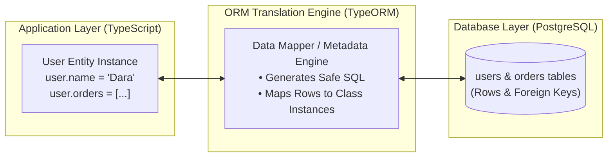

## 🎩 អ្វីទៅជា ORM?

**ORM (Object-Relational Mapping)** គឺជាបច្ចេកវិទ្យាដែលធ្វើស្ពានតភ្ជាប់រវាង **Object-Oriented / Typed Code (TypeScript/JavaScript Classes)** និង **Relational Database (Tables, Columns, Foreign Keys)**។



---

## 📊 ការប្រៀបធៀប Data Access Patterns

| វិធីសាស្ត្រ | ឧទាហរណ៍ Tools | គុណសម្បត្តិ | គុណវិបត្តិ |
|---|---|---|---|
| **Raw SQL** | `pg`, `mysql2` | ដំណើរការលឿនបំផុត (Zero Overhead), គ្រប់គ្រង SQL 100% | គ្មាន Type-Safety, ងាយនឹង typo, ពិបាក Re-factor |
| **Query Builder** | `Knex.js`, `Kysely` | បង្កើត Query dynamic តាម Javascript, ស្អាត | នៅតែត្រូវសរសេរ Schema និង Types ដាច់ដោយឡែក |
| **Full ORM** | `TypeORM`, `Prisma`, `Drizzle` | Type-Safe 100%, Auto-migration, Relationships ងាយស្រួល | មាន Performance Overhead បន្តិចបន្តួច, អាចជួប N+1 Problem បើមិនប្រយ័ត្ន |

---

## 🏛️ Active Record vs Data Mapper Patterns

TypeORM គាំទ្រ Pattern ធំៗទាំងពីរ៖

### 1. Active Record Pattern
Entity ផ្ទុកទាំងទិន្នន័យ និង Logic នៃ Database Operations ផ្ទាល់ខ្លួន៖
```typescript
// Active Record: ហៅ method លើ Class ផ្ទាល់
const user = await User.findOneBy({ email: "sok@example.com" });
user.isActive = false;
await user.save();
```

### 2. Data Mapper Pattern (Recommended for Large Architecture)
ញែកដាច់រវាង Data Model (Entity) និង Database Access (Repository)៖
```typescript
// Data Mapper: ប្រើ Repository ដាច់ដោយឡែក
const userRepository = AppDataSource.getRepository(User);
const user = await userRepository.findOneBy({ email: "sok@example.com" });
if (user) {
  user.isActive = false;
  await userRepository.save(user);
}
```

> [!TIP]
> ក្នុងវគ្គសិក្សានេះ យើងនឹងប្រើប្រាស់ **Data Mapper Pattern** ព្រោះវាជាស្ថាបត្យកម្មកម្រិត Enterprise ដែលជួយឱ្យ Codebase ងាយស្រួលធ្វើ Unit Test និង Maintain!
