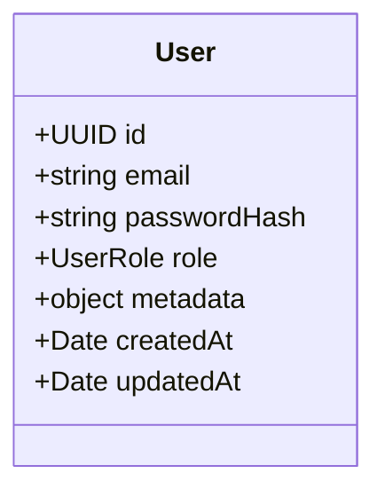

## 🏛️ អ្វីទៅជា TypeORM Entity?

**Entity** គឺជា TypeScript Class ដែលត្រូវគ្នានឹង Table មួយនៅក្នុង Database។ តាមរយៈ **Decorators** យើងអាចកំណត់ Attributes នៃ Columns នីមួយៗបានយ៉ាងលម្អិត។



---

## 💻 ឧទាហរណ៍ជាក់ស្តែង៖ `User.entity.ts`

```typescript
// src/entities/User.entity.ts
import {
  Entity,
  PrimaryGeneratedColumn,
  Column,
  CreateDateColumn,
  UpdateDateColumn,
  DeleteDateColumn,
  Index,
} from "typeorm";

export enum UserRole {
  ADMIN = "admin",
  MANAGER = "manager",
  CUSTOMER = "customer",
}

@Entity("users")
@Index(["email"], { unique: true })
export class User {
  @PrimaryGeneratedColumn("uuid")
  id: string;

  @Column({ type: "varchar", length: 100 })
  fullName: string;

  @Column({ type: "varchar", length: 255, unique: true })
  email: string;

  @Column({ type: "varchar", length: 255, select: false }) // select: false លាក់ password ពេល query
  passwordHash: string;

  @Column({
    type: "enum",
    enum: UserRole,
    default: UserRole.CUSTOMER,
  })
  role: UserRole;

  @Column({ type: "boolean", default: true })
  isActive: boolean;

  @Column({ type: "jsonb", nullable: true })
  preferences: {
    theme?: string;
    notifications?: boolean;
  };

  @CreateDateColumn({ type: "timestamptz" })
  createdAt: Date;

  @UpdateDateColumn({ type: "timestamptz" })
  updatedAt: Date;

  @DeleteDateColumn({ type: "timestamptz", select: false }) // សម្រាប់ Soft Delete
  deletedAt?: Date;
}
```

---

## 🔍 Column Options សំខាន់ៗ

| Option | ប្រភេទ | ការពិពណ៌នា |
|---|---|---|
| `type` | String | ប្រភេទ Data type ក្នុង Database (ឧ. `varchar`, `int`, `decimal`, `jsonb`) |
| `length` | Number | ប្រវែងអតិបរមាសម្រាប់ varchar/char |
| `unique` | Boolean | កំណត់ឱ្យទិន្នន័យមិនអាចស្ទួន (Unique constraint) |
| `nullable` | Boolean | អនុញ្ញាតឱ្យមានតម្លៃ `NULL` (Default: `false`) |
| `default` | Any | តម្លៃលំនាំដើមពេលបង្កើត Record ថ្មី |
| `select` | Boolean | ប្រសិនបើកំណត់ `false` column នេះនឹងមិនបង្ហាញពេល SELECT ធម្មតា (ស័ក្តិសមសម្រាប់ Passwords) |
