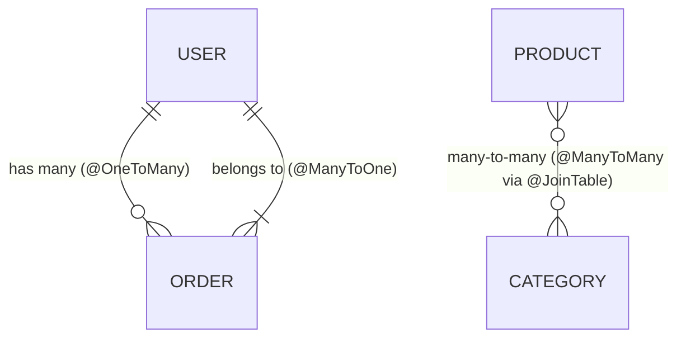

## 🔗 ការបង្កើត Relationships ក្នុង TypeORM



---

## 1. One-to-Many & Many-to-One (User ↔ Order)

### `src/entities/Order.entity.ts` (Owner Side)
```typescript
import { Entity, PrimaryGeneratedColumn, Column, ManyToOne, JoinColumn } from "typeorm";
import { User } from "./User.entity";

@Entity("orders")
export class Order {
  @PrimaryGeneratedColumn("uuid")
  id: string;

  @Column({ type: "decimal", precision: 10, scale: 2 })
  totalAmount: number;

  @Column({ type: "varchar", default: "pending" })
  status: string;

  // Many Orders belong to One User
  @ManyToOne(() => User, (user) => user.orders, { onDelete: "CASCADE" })
  @JoinColumn({ name: "user_id" })
  user: User;
}
```

### `src/entities/User.entity.ts` (Inverse Side)
```typescript
import { Entity, PrimaryGeneratedColumn, Column, OneToMany } from "typeorm";
import { Order } from "./Order.entity";

@Entity("users")
export class User {
  @PrimaryGeneratedColumn("uuid")
  id: string;

  @Column()
  name: string;

  // One User has Many Orders
  @OneToMany(() => Order, (order) => order.user)
  orders: Order[];
}
```

---

## 2. Many-to-Many (Product ↔ Category)

```typescript
// src/entities/Product.entity.ts
import { Entity, PrimaryGeneratedColumn, Column, ManyToMany, JoinTable } from "typeorm";
import { Category } from "./Category.entity";

@Entity("products")
export class Product {
  @PrimaryGeneratedColumn("uuid")
  id: string;

  @Column()
  title: string;

  @ManyToMany(() => Category, (category) => category.products)
  @JoinTable({
    name: "product_categories", // ឈ្មោះ Junction Table
    joinColumn: { name: "product_id", referencedColumnName: "id" },
    inverseJoinColumn: { name: "category_id", referencedColumnName: "id" },
  })
  categories: Category[];
}
```

---

## 🚀 ការទាញយកទិន្នន័យដែលមាន Relations

```typescript
const userRepository = AppDataSource.getRepository(User);

// Explicit Relations Loading
const userWithOrders = await userRepository.findOne({
  where: { id: "a0eebc99-9c0b-4ef8-bb6d-6bb9bd380a11" },
  relations: {
    orders: true,
  },
});
```
