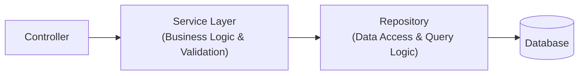

## 🏛️ អ្វីទៅជា Repository Pattern?

**Repository Pattern** ដើរតួជាស្រទាប់កណ្តាល (Abstraction Layer) រវាង **Domain/Business Logic (Services)** និង **Data Mapping Layer (Database)**។



---

## 🛠️ Methods សំខាន់ៗរបស់ TypeORM Repository

```typescript
import { AppDataSource } from "../config/data-source";
import { User, UserRole } from "../entities/User.entity";
import { Like, MoreThan, In } from "typeorm";

const userRepo = AppDataSource.getRepository(User);

// 1. CREATE & SAVE
const newUser = userRepo.create({
  fullName: "Keo Sophea",
  email: "sophea@example.com",
  role: UserRole.CUSTOMER,
});
await userRepo.save(newUser); // SQL: INSERT INTO users...

// 2. FIND WITH FILTERS & PAGINATION
const [users, totalCount] = await userRepo.findAndCount({
  where: {
    isActive: true,
    role: In([UserRole.ADMIN, UserRole.MANAGER]),
  },
  order: { createdAt: "DESC" },
  take: 10, // LIMIT 10
  skip: 0,  // OFFSET 0
  select: ["id", "fullName", "email", "role", "createdAt"],
});

// 3. FIND ONE OR FAIL
const user = await userRepo.findOneByOrFail({ id: "uuid-here" });

// 4. UPDATE
await userRepo.update({ id: "uuid-here" }, { isActive: false });

// 5. SOFT DELETE & RESTORE
await userRepo.softDelete({ id: "uuid-here" }); // កំណត់ deletedAt = NOW()
await userRepo.restore({ id: "uuid-here" });    // កំណត់ deletedAt = NULL
```

---

## 💡 ការបង្កើត Custom Extended Repository

អ្នកអាចពង្រីកសមត្ថភាព Repository ដោយបន្ថែម Methods ផ្ទាល់ខ្លួន៖

```typescript
// src/repositories/user.repository.ts
import { AppDataSource } from "../config/data-source";
import { User } from "../entities/User.entity";

export const UserRepository = AppDataSource.getRepository(User).extend({
  async findByEmailWithPassword(email: string): Promise<User | null> {
    return this.createQueryBuilder("user")
      .addSelect("user.passwordHash")
      .where("user.email = :email", { email: email.toLowerCase() })
      .getOne();
  },

  async countActiveAdmins(): Promise<number> {
    return this.count({
      where: { role: "admin", isActive: true },
    });
  },
});
```
