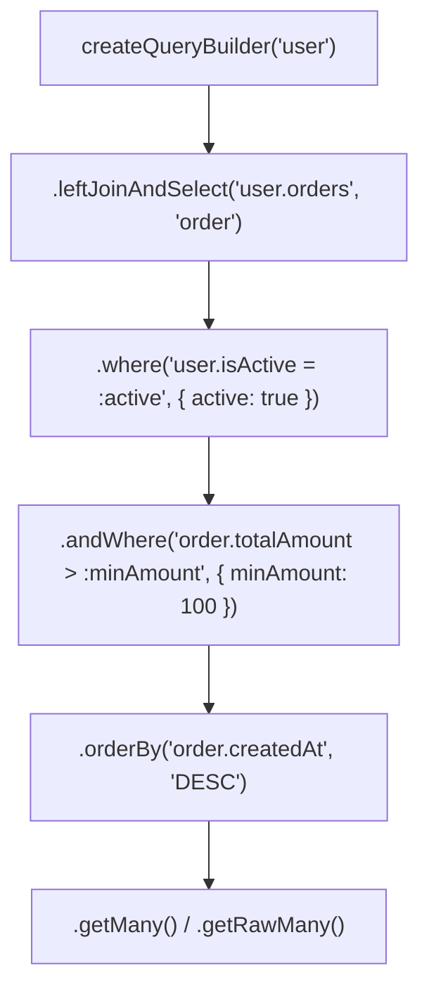

## 🏗️ ហេតុអ្វីត្រូវប្រើ QueryBuilder?

ខណៈពេលដែល `repository.find()` ងាយស្រួលសម្រាប់ CRUD សាមញ្ញ នៅពេលដែលអ្នកត្រូវការ៖
- ការ Search ពាក្យគន្លឹះលើ Columns ច្រើន (Complex WHERE conditions)
- ការគណនា Aggregations (SUM, AVG, GROUP BY, HAVING)
- Subqueries ឬ Pagination ស្មុគស្មាញ

**QueryBuilder** ផ្តល់អំណាចពេញលេញដូច Raw SQL តែមាន **Type Safety និង Parameterized Safety** ស្រាប់!



---

## 💻 ឧទាហរណ៍ជាក់ស្តែង៖ Dynamic Filter & Search Service

```typescript
import { AppDataSource } from "../config/data-source";
import { Product } from "../entities/Product.entity";

interface ProductFilterParams {
  search?: string;
  category?: string;
  minPrice?: number;
  maxPrice?: number;
  page?: number;
  limit?: number;
}

export async function searchProducts(filters: ProductFilterParams) {
  const {
    search,
    category,
    minPrice,
    maxPrice,
    page = 1,
    limit = 10,
  } = filters;

  const query = AppDataSource.getRepository(Product)
    .createQueryBuilder("product")
    .leftJoinAndSelect("product.category", "category");

  // 1. Dynamic Search (Title or Description)
  if (search) {
    query.andWhere(
      "(product.title ILIKE :search OR product.description ILIKE :search)",
      { search: `%${search}%` }
    );
  }

  // 2. Category Filter
  if (category) {
    query.andWhere("category.slug = :category", { category });
  }

  // 3. Price Range Filter
  if (minPrice !== undefined) {
    query.andWhere("product.price >= :minPrice", { minPrice });
  }
  if (maxPrice !== undefined) {
    query.andWhere("product.price <= :maxPrice", { maxPrice });
  }

  // 4. Pagination & Ordering
  query
    .orderBy("product.createdAt", "DESC")
    .skip((page - 1) * limit)
    .take(limit);

  const [items, total] = await query.getManyAndCount();

  return {
    items,
    pagination: {
      page,
      limit,
      total,
      totalPages: Math.ceil(total / limit),
    },
  };
}
```

---

## 📈 Aggregation Queries ជាមួយ `getRawMany()`

```typescript
// គណនាផលបូកនៃការលក់តាម Category
const salesReport = await AppDataSource.getRepository(Product)
  .createQueryBuilder("product")
  .leftJoin("product.category", "category")
  .select("category.name", "categoryName")
  .addSelect("COUNT(product.id)", "totalProducts")
  .addSelect("AVG(product.price)", "averagePrice")
  .groupBy("category.name")
  .getRawMany();
```
