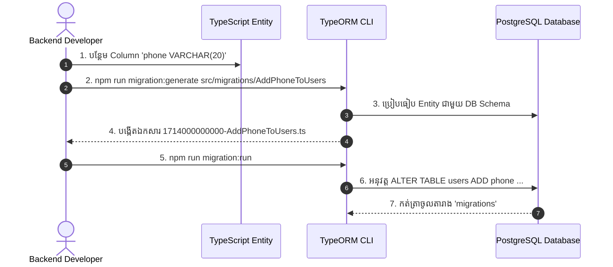

## 🏗️ ការកំណត់ TypeORM CLI ក្នុង `package.json`

ដើម្បីងាយស្រួលរត់ពាក្យបញ្ជា Migration ក្នុង TypeScript យើងបន្ថែម Scripts ក្នុង `package.json`៖

```json
{
  "scripts": {
    "typeorm": "typeorm-ts-node-commonjs -d ./src/config/data-source.ts",
    "migration:generate": "npm run typeorm -- migration:generate",
    "migration:run": "npm run typeorm -- migration:run",
    "migration:revert": "npm run typeorm -- migration:revert",
    "migration:create": "typeorm-ts-node-commonjs migration:create"
  }
}
```

---

## 🔄 Workflow នៃការធ្វើ Migration ជាក់ស្តែង



---

## 💻 ឧទាហរណ៍ឯកសារ Migration ដែលបានបង្កើត

```typescript
// src/migrations/1714000000000-AddPhoneToUsers.ts
import { MigrationInterface, QueryRunner } from "typeorm";

export class AddPhoneToUsers1714000000000 implements MigrationInterface {
  name = "AddPhoneToUsers1714000000000";

  public async up(queryRunner: QueryRunner): Promise<void> {
    await queryRunner.query(
      `ALTER TABLE "users" ADD "phone" character varying(20)`
    );
    await queryRunner.query(
      `CREATE INDEX "IDX_users_phone" ON "users" ("phone")`
    );
  }

  public async down(queryRunner: QueryRunner): Promise<void> {
    await queryRunner.query(`DROP INDEX "IDX_users_phone"`);
    await queryRunner.query(`ALTER TABLE "users" DROP COLUMN "phone"`);
  }
}
```

---

## ⚡ ពាក្យបញ្ជាសំខាន់ៗ

```bash
# 1. បង្កើត Migration ដោយស្វ័យប្រវត្តិតាម Entity Changes
npm run migration:generate src/migrations/InitialSchema

# 2. អនុវត្ត Migrations ទាំងអស់ដែលមិនទាន់បាន Run
npm run migration:run

# 3. Rollback Migration ចុងក្រោយគេបង្អស់ថយក្រោយ ១ ជំហាន
npm run migration:revert
```
