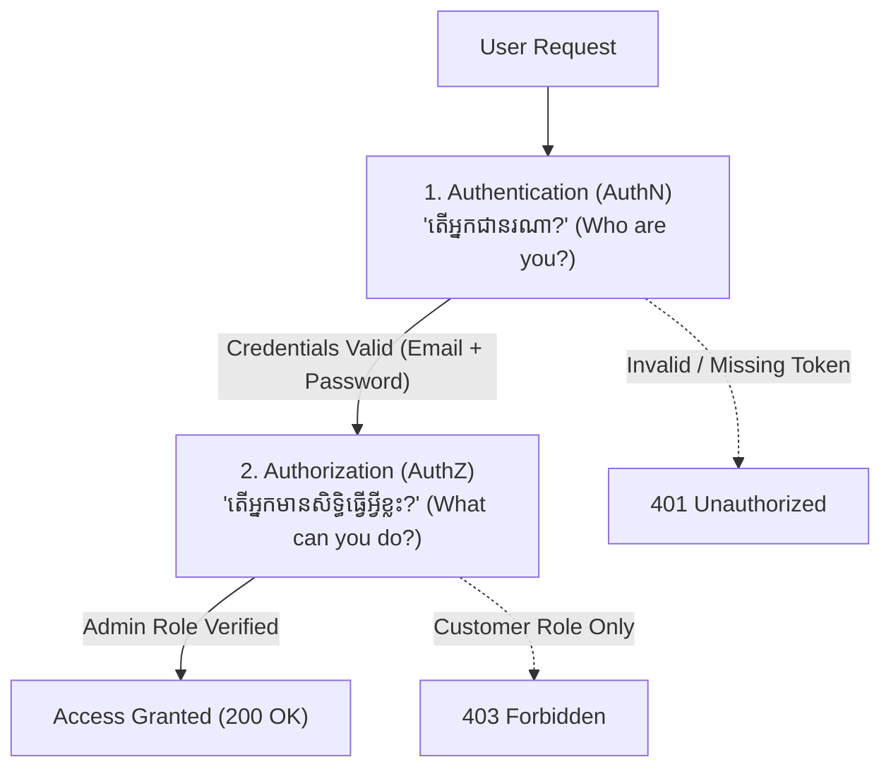
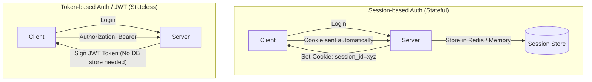

## 🔐 ភាពខុសគ្នារវាង AuthN និង AuthZ

| លក្ខណៈ | Authentication (AuthN) | Authorization (AuthZ) |
|---|---|---|
| **និយមន័យ** | ការផ្ទៀងផ្ទាត់អត្តសញ្ញាណអ្នកប្រើប្រាស់ | ការត្រួតពិនិត្យសិទ្ធិ ឬតួនាទីក្នុងការប្រើប្រាស់ Resource |
| **សំណួរចម្បង** | "តើអ្នកជានរណា?" | "តើអ្នកអាចធ្វើអ្វីបានខ្លះ?" |
| **មធ្យោបាយ** | Passwords, OTP, Biometrics, OAuth (Google/GitHub) | Roles, Permissions, Policies, ACLs |
| **HTTP Status Code** | `401 Unauthorized` | `403 Forbidden` |

---

## ⚖️ Session-Based vs Token-Based Authentication

| លក្ខណៈសម្បត្តិ | Session-Based (Cookies) | Token-Based (JWT) |
|---|---|---|
| **Server State** | Stateful (ត្រូវការ RAM ឬ Redis ផ្ទុក Session) | Stateless (Server មិនបាច់ចាំ State ទេ) |
| **Scalability** | ពិបាក Scale ពេលមាន Servers ច្រើន (ត្រូវការ Sticky Sessions/Redis) | ងាយស្រួល Scale លើ Microservices & Serverless |
| **Mobile & Cross-domain** | ពិបាក Configure Cookie លើ Mobile Apps | ស្រួលប្រើជាមួយ REST API, Mobile Apps, SPAs |
| **Revocation** | ស្រួលលុបចោលភ្លាមៗ (Delete Session ពី Redis) | ត្រូវការ Refresh Token Rotation ឬ Blacklist |
