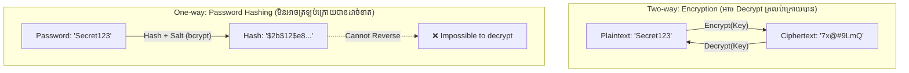
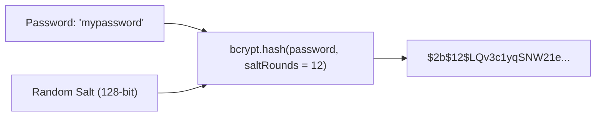

## 🔒 ភាពខុសគ្នារវាង Encryption និង Hashing



---

## 🧂 អ្វីទៅជា Salt?

ប្រសិនបើ User ពីរនាក់ប្រើ Password ដូចគ្នា (`password123`) បើគ្មាន Salt ទេ Hash របស់ពួកគេនឹងចេញដូចគ្នា ១០០% ដែលអនុញ្ញាតឱ្យ Hacker ប្រើ **Rainbow Tables (តារាង Hash ទុកជាមុន)** ដើម្បី Crack បាន។

**Salt** គឺជាអក្សរចៃដន្យ (Cryptographically Secure Random String) ដែលត្រូវបន្ថែមចូល Password មុនពេល Hash។ វានឹងបង្កើត Hash ខុសៗគ្នាទាំងស្រុងជានិច្ច!



---

## 💻 ការអនុវត្ត Hashing ជាក់ស្តែងជាមួយ `bcrypt`

```bash
npm install bcrypt
npm install -D @types/bcrypt
```

### 1. Helper Module (`src/utils/password.ts`)
```typescript
import bcrypt from 'bcrypt';

const SALT_ROUNDS = 12; // ស្តង់ដារសមស្របសម្រាប់ Production (ប្រមាណ ~250ms លើ Server)

export const hashPassword = async (plainTextPassword: string): Promise<string> => {
  const salt = await bcrypt.genSalt(SALT_ROUNDS);
  return bcrypt.hash(plainTextPassword, salt);
};

export const comparePassword = async (
  plainTextPassword: string,
  hashedPassword: string
): Promise<boolean> => {
  // Constant-time comparison ការពារ Timing Attacks
  return bcrypt.compare(plainTextPassword, hashedPassword);
};
```

### 2. ការប្រើប្រាស់ក្នុង Auth Service (`src/services/auth.service.ts`)
```typescript
import { hashPassword, comparePassword } from '../utils/password';
import { UserRepository } from '../repositories/user.repository';

export class AuthService {
  async register(email: string, plainPassword: string) {
    const existing = await UserRepository.findOneBy({ email });
    if (existing) {
      throw new Error("Email នេះត្រូវបានចុះឈ្មោះរួចហើយ!");
    }

    const passwordHash = await hashPassword(plainPassword);
    const user = UserRepository.create({ email, passwordHash });
    await UserRepository.save(user);

    return { id: user.id, email: user.email };
  }

  async login(email: string, plainPassword: string) {
    const user = await UserRepository.findByEmailWithPassword(email);
    if (!user) {
      throw new Error("Email ឬពាក្យសម្ងាត់មិនត្រឹមត្រូវឡើយ");
    }

    const isValid = await comparePassword(plainPassword, user.passwordHash);
    if (!isValid) {
      throw new Error("Email ឬពាក្យសម្ងាត់មិនត្រឹមត្រូវឡើយ");
    }

    return user;
  }
}
```
