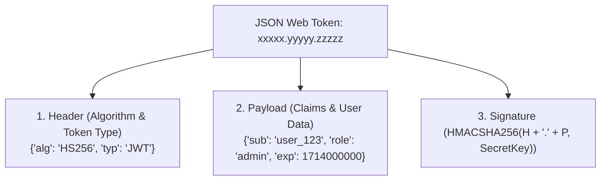

## 🪙 អ្វីទៅជា JSON Web Token (JWT)?

**JWT (JSON Web Token)** គឺជាស្តង់ដារបើកចំហរ (RFC 7519) សម្រាប់ការបញ្ជូនព័ត៌មានរវាងភាគីពីរដោយសុវត្ថិភាព និងបង្រួមតូច (Compact & Self-contained)។



---

## ⚙️ ការប្រើប្រាស់ `jsonwebtoken` ក្នុង TypeScript

```bash
npm install jsonwebtoken
npm install -D @types/jsonwebtoken
```

### 1. Token Helper Service (`src/utils/jwt.ts`)
```typescript
import jwt, { SignOptions } from 'jsonwebtoken';

const JWT_SECRET = process.env.JWT_SECRET || 'super_secret_dev_key';
const JWT_EXPIRES_IN = '15m'; // Access Token អាយុខ្លី

export interface UserTokenPayload {
  userId: string;
  email: string;
  role: string;
}

export const signToken = (payload: UserTokenPayload, options?: SignOptions): string => {
  return jwt.sign(payload, JWT_SECRET, {
    expiresIn: JWT_EXPIRES_IN,
    algorithm: 'HS256',
    ...options,
  });
};

export const verifyToken = (token: string): UserTokenPayload => {
  try {
    return jwt.verify(token, JWT_SECRET) as UserTokenPayload;
  } catch (error: any) {
    if (error.name === 'TokenExpiredError') {
      throw new Error('Token ផុតកំណត់សុពលភាពហើយ (Token Expired)');
    }
    throw new Error('Token មិនត្រឹមត្រូវឡើយ (Invalid Token)');
  }
};
```

---

## 🛡️ ច្បាប់សុវត្ថិភាពសំខាន់ៗពេលប្រើ JWT

> [!WARNING]
> 1. **ហាមដាច់ខាត:** កុំដាក់ Passwords, Credit Card numbers, ឬ Private Secrets ទៅក្នុង JWT Payload។
> 2. **កំណត់ Expiration ជានិច្ច:** ត្រូវកំណត់អាយុកាល Token ខ្លី (ឧ. 15 នាទីទៅ 1 ម៉ោង) សម្រាប់ Access Token។
> 3. **ការពារ Secret Key:** ប្រើ Secret Key ដែលមានប្រវែងយ៉ាងតិច 256 bits (32+ bytes random characters)។
