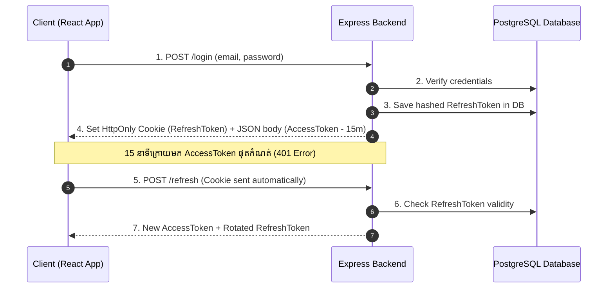

## 🔄 ហេតុអ្វីត្រូវមាន Access Token និង Refresh Token?

- **Access Token:** មានអាយុខ្លី (ឧ. 15 នាទី) ប្រើសម្រាប់ផ្ញើទៅកាន់ Protected API routes គ្រប់ពេល។ បើទោះជា Hacker លួចបាន ក៏ប្រើបានត្រឹម ១៥ នាទីប៉ុណ្ណោះ។
- **Refresh Token:** មានអាយុវែង (ឧ. 7 ថ្ងៃ ឬ 30 ថ្ងៃ) រក្សាទុកក្នុង Database និងបញ្ជូនតាម **HttpOnly Cookie** សម្រាប់ស្នើសុំ Access Token ថ្មីពេល Access Token ចាស់ផុតកំណត់។



---

## 💻 ការអនុវត្ត Refresh Token Rotation

### 1. Endpoint Login & Cookie Setting
```typescript
import { Request, Response } from "express";
import jwt from "jsonwebtoken";

export const loginHandler = async (req: Request, res: Response) => {
  const { user } = req; // ក្រោយ verify password

  const accessToken = jwt.sign(
    { userId: user.id, role: user.role },
    process.env.ACCESS_TOKEN_SECRET!,
    { expiresIn: "15m" }
  );

  const refreshToken = jwt.sign(
    { userId: user.id },
    process.env.REFRESH_TOKEN_SECRET!,
    { expiresIn: "7d" }
  );

  // កត់ត្រា refresh token ចូល DB ឬ Redis សម្រាប់តាមដាន
  await saveUserRefreshToken(user.id, refreshToken);

  // ផ្ញើ Refresh Token តាម HttpOnly Cookie
  res.cookie("refreshToken", refreshToken, {
    httpOnly: true,
    secure: process.env.NODE_ENV === "production", // ប្រើ HTTPS លើ production
    sameSite: "strict",
    maxAge: 7 * 24 * 60 * 60 * 1000, // 7 ថ្ងៃ
  });

  res.status(200).json({
    success: true,
    accessToken,
    user: { id: user.id, email: user.email, role: user.role },
  });
};
```

### 2. Endpoint Refresh Token
```typescript
export const refreshHandler = async (req: Request, res: Response) => {
  const token = req.cookies.refreshToken;
  if (!token) {
    return res.status(401).json({ message: "Refresh token is missing" });
  }

  try {
    const payload = jwt.verify(token, process.env.REFRESH_TOKEN_SECRET!) as any;
    const isValid = await checkRefreshTokenInDB(payload.userId, token);

    if (!isValid) {
      return res.status(403).json({ message: "Invalid or reused refresh token" });
    }

    const newAccessToken = jwt.sign(
      { userId: payload.userId, role: payload.role },
      process.env.ACCESS_TOKEN_SECRET!,
      { expiresIn: "15m" }
    );

    res.json({ accessToken: newAccessToken });
  } catch (err) {
    res.status(403).json({ message: "Refresh token expired or invalid" });
  }
};
```
