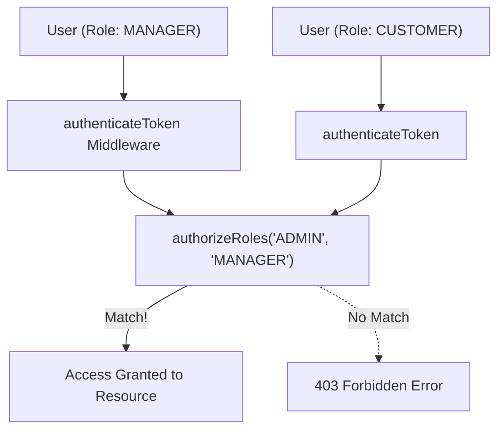

## 👥 អ្វីទៅជា Role-Based Access Control (RBAC)?

**RBAC** គឺជាវិធីសាស្ត្រចាត់ចែងសិទ្ធិដោយផ្អែកលើ **Roles (តួនាទី)** របស់អ្នកប្រើប្រាស់នៅក្នុងស្ថាប័ន ឬប្រព័ន្ធ។



---

## 🛡️ ការបង្កើត Reusable RBAC Middleware

```typescript
// src/middlewares/authorize.ts
import { Request, Response, NextFunction } from "express";

export const authorizeRoles = (...allowedRoles: string[]) => {
  return (req: Request, res: Response, next: NextFunction) => {
    // ត្រូវប្រាកដថា User បាន Authenticate រួចរាល់
    if (!req.user) {
      return res.status(401).json({
        success: false,
        message: "Unauthorized: សូមធ្វើការ Login ជាមុនសិន",
      });
    }

    if (!allowedRoles.includes(req.user.role)) {
      return res.status(403).json({
        success: false,
        message: `Forbidden: តួនាទី (${req.user.role}) មិនមានសិទ្ធិចូលដំណើរការផ្នែកនេះឡើយ`,
      });
    }

    next();
  };
};
```

---

## 🔒 Resource Ownership Guard Pattern

```typescript
// Middleware ឆែកមើលថាតើ User កំពុងកែប្រែ Resource របស់ខ្លួនឯង ឬជា Admin
export const checkOrderOwnership = async (
  req: Request,
  res: Response,
  next: NextFunction
) => {
  const { orderId } = req.params;
  const currentUserId = req.user.userId;
  const currentUserRole = req.user.role;

  // Admin មានសិទ្ធិគ្រប់គ្រង Order ទាំងអស់
  if (currentUserRole === "admin") {
    return next();
  }

  const order = await orderRepository.findOneBy({ id: orderId });
  if (!order) {
    return res.status(404).json({ message: "រកមិនឃើញ Order ឡើយ" });
  }

  if (order.userId !== currentUserId) {
    return res.status(403).json({
      message: "Forbidden: អ្នកគ្មានសិទ្ធិកែប្រែ Order របស់អ្នកដទៃឡើយ",
    });
  }

  next();
};
```
