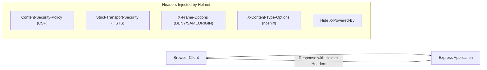

## 🛡️ អ្វីទៅជា Helmet.js?

**Helmet.js** គឺជា Middleware ដ៏សំខាន់សម្រាប់ Express ដែលជួយកំណត់ **HTTP Security Headers** សំខាន់ៗចំនួន ១៥+ ដោយស្វ័យប្រវត្តិ ដើម្បីការពារកម្មវិធីពីការវាយប្រហារទូទៅដូចជា Clickjacking, XSS, MIME-sniffing ជាដើម។



---

## 📦 ការដំឡើង និង Configure Helmet

```bash
npm install helmet
```

```javascript
import express from 'express';
import helmet from 'helmet';

const app = express();

// 1. បើកប្រើ Default Protection ទាំងអស់
app.use(helmet());

// 2. ឬ Custom CSP សម្រាប់ APIs
app.use(
  helmet({
    contentSecurityPolicy: {
      directives: {
        defaultSrc: ["'self'"],
        scriptSrc: ["'self'", "https://trusted-cdn.com"],
        styleSrc: ["'self'", "'unsafe-inline'"],
        imgSrc: ["'self'", "data:", "https://images.unsplash.com"],
      },
    },
    crossOriginEmbedderPolicy: false,
  })
);
```

---

## 📋 តារាង Headers សំខាន់ៗដែល Helmet គ្រប់គ្រង

| HTTP Header | ការពារពីអ្វី | មុខងារ |
|---|---|---|
| `Content-Security-Policy` | XSS & Data Injection | កំណត់ប្រភព Domain ដែលអនុញ្ញាតឱ្យ Load Scripts/Styles/Images |
| `X-Frame-Options` | Clickjacking | បិទមិនឱ្យគេហទំព័រផ្សេងយក API/App របស់យើងទៅបង្កប់ក្នុង `<iframe>` |
| `Strict-Transport-Security` | Man-in-the-Middle | បង្ខំឱ្យ Browser ប្រើតែ **HTTPS** ជានិច្ច |
| `X-Content-Type-Options` | MIME-sniffing | បង្ខំឱ្យ Browser គោរព `Content-Type` ពិតប្រាកដ |
