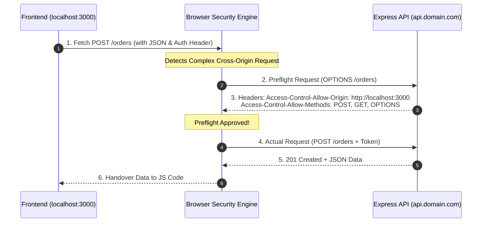

## 🌐 អ្វីទៅជា CORS & Same-Origin Policy?

**SOP (Same-Origin Policy)** គឺជាយន្តការសុវត្ថិភាពស្នូលរបស់ Web Browser ដែលហាមឃាត់ Script នៅលើ Domain មួយ (ឧ. `http://localhost:3000` - React) មិនឱ្យស្នើសុំទិន្នន័យពី Domain មួយផ្សេងទៀត (ឧ. `http://localhost:5000` - Express)។

**CORS (Cross-Origin Resource Sharing)** គឺជាវិធីដែល Backend Server ប្រាប់ Browser ថា Domain ណាខ្លះដែលត្រូវបានអនុញ្ញាត!



---

## 💻 ការ Configure CORS សម្រាប់ Production

```bash
npm install cors
npm install -D @types/cors
```

```typescript
// src/config/cors.ts
import cors, { CorsOptions } from "cors";

const allowedOrigins = [
  "http://localhost:3000",
  "https://my-ecommerce-app.com",
  "https://admin.my-ecommerce-app.com",
];

export const corsOptions: CorsOptions = {
  origin: (origin, callback) => {
    // អនុញ្ញាត Mobile Apps, Postman, ឬ Servers ដែលគ្មាន Origin Header
    if (!origin || allowedOrigins.includes(origin)) {
      callback(null, true);
    } else {
      callback(new Error(`CORS Blocked: Origin ${origin} មិនត្រូវបានអនុញ្ញាតឡើយ`));
    }
  },
  credentials: true, // អនុញ្ញាតការផ្ញើ Cookies & Auth Headers
  methods: ["GET", "POST", "PUT", "PATCH", "DELETE", "OPTIONS"],
  allowedHeaders: ["Content-Type", "Authorization", "X-Requested-With"],
  maxAge: 86400, // Cache Preflight Response រយៈពេល 24 ម៉ោង (កាត់បន្ថយ OPTIONS calls)
};
```

### ការប្រើប្រាស់ក្នុង `app.ts`:
```typescript
import express from "express";
import cors from "cors";
import { corsOptions } from "./config/cors";

const app = express();
app.use(cors(corsOptions));
```
