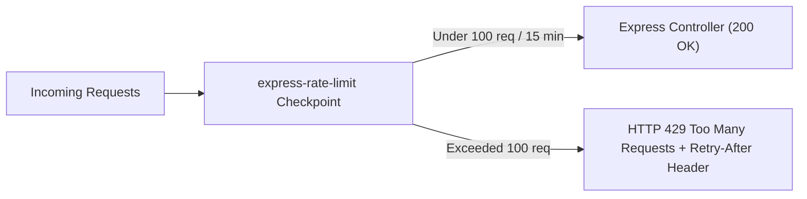

## 🛑 ហេតុអ្វីត្រូវមាន Rate Limiting?

ប្រសិនបើគ្មាន Rate Limiting ទេ៖
1. **Brute-Force Attacks:** Hacker អាចសាកល្បង Login Password រាប់ពាន់ដងក្នុង ១ វិនាទី។
2. **API Abuse & Scraping:** Bots អាចទាញយកទិន្នន័យផលិតផលទាំងអស់ពី Server ធ្វើឱ្យ Database ធ្លាក់ល្បឿន។
3. **DoS (Denial of Service):** ការផ្ញើ Requests ច្រើនហួសប្រមាណធ្វើឱ្យ Server គាំង។



---

## 💻 ការអនុវត្តជាក់ស្តែងជាមួយ `express-rate-limit`

```bash
npm install express-rate-limit
```

### 1. Global API Rate Limiter (`src/middlewares/rateLimiter.ts`)
```typescript
import rateLimit from "express-rate-limit";

// 1. General Limiter សម្រាប់ endpoints ធម្មតា
export const generalApiLimiter = rateLimit({
  windowMs: 15 * 60 * 1000, // 15 នាទី
  max: 100, // អនុញ្ញាតអតិបរមា 100 requests ក្នុង 1 IP
  standardHeaders: true, // បញ្ជូន `RateLimit-*` headers ត្រលប់ទៅ client
  legacyHeaders: false,
  message: {
    success: false,
    message: "អ្នកបានផ្ញើសំណើច្រើនដងពេកហើយ សូមរង់ចាំ ១៥ នាទីសិនមុននឹងព្យាយាមម្តងទៀត! (429 Too Many Requests)",
  },
});

// 2. Strict Auth Limiter សម្រាប់ Login / Register
export const authRateLimiter = rateLimit({
  windowMs: 60 * 60 * 1000, // 1 ម៉ោង
  max: 5, // អនុញ្ញាតឱ្យ login ខុសត្រឹមតែ 5 ដងប៉ុណ្ណោះក្នុង 1 ម៉ោង
  message: {
    success: false,
    message: "ការប៉ុនប៉ង Login បរាជ័យច្រើនដងពេក គណនីរបស់អ្នកត្រូវបានផ្អាកជាបណ្តោះអាសន្ន ១ ម៉ោងដើម្បីសុវត្ថិភាព!",
  },
});
```

### 2. ការប្រើប្រាស់ក្នុង Application
```typescript
import express from "express";
import { generalApiLimiter, authRateLimiter } from "./middlewares/rateLimiter";
import authRoutes from "./routes/auth.routes";

const app = express();

// អនុវត្តលើគ្រប់ /api/ routes ទាំងអស់
app.use("/api", generalApiLimiter);

// អនុវត្ត Strict Limit លើតែ Auth routes
app.use("/api/v1/auth", authRateLimiter, authRoutes);
```
